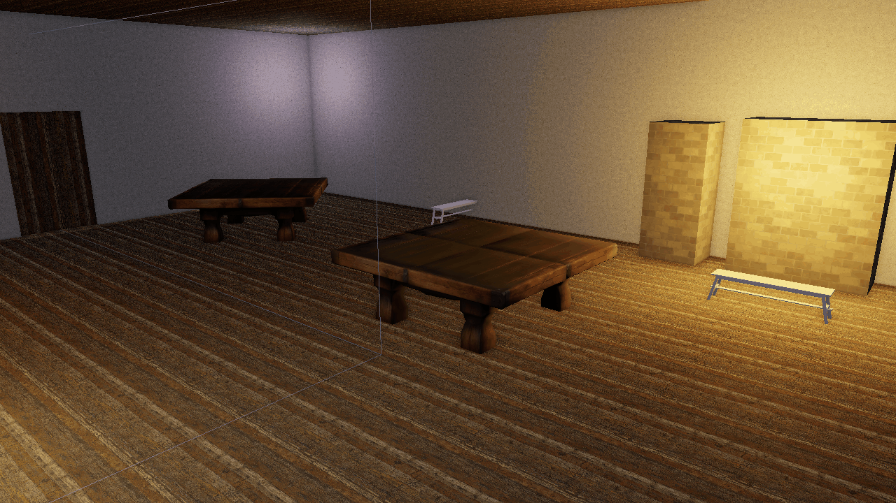

# Lighting

Lights in Flint are ordinary entities with a `light` component. The renderer reads them every frame, sorts them by name so the shadow-casting sun is stable across reloads, and feeds them to the PBR shader alongside a set of scene-wide shading levers authored in the `[environment]` block. This page owns all of that: the light component, cascaded and contact-hardening shadows, area lights, and the "clay look" levers.

## The Light Component

```toml
[entities.sun.light]
type = "directional"
direction = [0.5, 1.0, 0.3]        # points toward the light
color = [1.0, 0.98, 0.95]
intensity = 3.0
angular_size = 0.5                 # degrees; drives PCSS penumbra

[entities.lantern.light]
type = "point"
color = [1.0, 0.7, 0.4]
intensity = 8.0
range = 12.0
source_radius = 0.15               # meters; softens the specular hotspot

[entities.spot.light]
type = "spot"
direction = [0.0, -1.0, 0.0]
color = [1.0, 1.0, 1.0]
intensity = 20.0
range = 15.0
inner_angle = 0.3                  # radians
outer_angle = 0.5
source_radius = 0.1
```

Point and spot lights sit at their entity's world position, so they follow transform hierarchies and animation like any other entity. Directional lights ignore position.

| Field | Applies to | Type | Default | Description |
|-------|-----------|------|---------|-------------|
| `type` | all | string | `"directional"` | `directional`, `point` or `spot` |
| `color` | all | [f32; 3] | `[1, 1, 1]` | Linear RGB |
| `intensity` | all | f32 | `1.0` | Radiance multiplier |
| `direction` | directional, spot | [f32; 3] | `[0, -1, 0]` | For directional lights this points **toward** the light; for spots it is the cone axis |
| `angular_size` | directional | f32 | `0.0` | Apparent size of the source in degrees (sun about 0.5, softbox 2--5). 0 keeps hard 3x3 PCF shadows (ADR 0056) |
| `range` (alias `radius`) | point, spot | f32 | `10.0` | Falloff distance in world units |
| `source_radius` | point, spot | f32 | `0.0` | Physical radius of the emitter in meters; 0 = punctual (ADR 0056) |
| `inner_angle` | spot | f32 | `0.3` | Full-intensity cone half-angle, radians |
| `outer_angle` | spot | f32 | `0.5` | Cone edge half-angle, radians |
| `volumetric_intensity` | directional | f32 | `0.0` | God-ray strength for this light; see [Post-Processing](post-processing.md#volumetric-lighting-god-rays) |
| `volumetric_color` | directional | [f32; 3] | light color | Tint of the shafts |

There is no `light.toml` in `schemas/components`; the renderer reads these keys straight from the component table, so `flint validate` will not catch a typo in a light field. Scenes that need a schema can add one in their own `schemas/` layer.

Limits: the shader takes a fixed number of directional, point and spot lights. Only one directional light casts cascaded shadows: the one with the highest `intensity`, with entity-name order breaking ties (ADR 0045), so a fill light can never steal the sun's shadows because of how it was named. If no scene light exists at all, the renderer falls back to a built-in warm key light and cool fill.

## Area Lights

`source_radius` on point and spot lights, and `angular_size` on directional lights, turn punctual lights into small area sources (ADR 0056). The specular lobe uses the representative-point approximation: effective roughness widens by `source_radius / (2 * distance)` and shading distance never falls inside the source, so the hotspot on a glossy floor becomes a soft disc instead of a pinprick. Diffuse lighting is unaffected. A value of 0 takes the original code path exactly.

## Shadows

Directional lights cast shadows through cascaded shadow maps: several cascades cover increasing distance bands from the camera, giving crisp shadows nearby and broad coverage far away. Shadows can be disabled per launch with `--no-shadows`, and toggled at runtime in the Rendering & Effects menu (F4).

**Resolution.** `--shadow-resolution` defaults to 2048 texels per cascade. Before ADR 0049 the shader hardcoded a 1/2048 texel size, so any other resolution filtered incorrectly and the flag was effectively decorative. The texel size is now uploaded with the cascade uniforms, so 512, 1024 and 4096 are real choices; the F4 menu's Shadows section rebuilds the shadow pass when you pick one.

**Contact hardening (PCSS).** When the shadow-casting directional light has a non-zero `angular_size`, the shader switches from a fixed 3x3 PCF kernel to percentage-closer soft shadows (ADR 0057): a Vogel-disk blocker search estimates the average occluder depth, the penumbra width grows with the occluder-to-receiver distance and `tan(angular_size)`, and the filter kernel is sized to match. Shadows are sharp where an object touches the ground and soften as it lifts away. `angular_size = 0` takes the legacy PCF path verbatim, which keeps existing renders byte-identical.

**Skinned casters.** Skinned meshes cast shadows through a dedicated `vs_skinned_shadow` entry point that applies bone transforms before the depth write.

## The `[environment]` Block

Scene-wide shading lives in `[environment]`, next to the skybox path. Every lever here follows the same convention: absent or zero means the exact original shading, so scenes that never set them look the way they always did.

```toml
[environment]
skybox = "textures/dusk.hdr"
ambient_sky = [0.12, 0.13, 0.18]
ambient_ground = [0.06, 0.05, 0.04]
diffuse_wrap = 0.3
oren_nayar = 0.7
sheen_color = [1.0, 0.9, 0.8]
sheen_strength = 0.15
```

| Field | Type | Default | Description |
|-------|------|---------|-------------|
| `skybox` | string | none | Equirectangular panorama for the sky |
| `ambient_sky` | [f32; 3] | `[0.12, 0.13, 0.18]` | Hemisphere ambient, upper half (linear RGB) |
| `ambient_ground` | [f32; 3] | `[0.06, 0.05, 0.04]` | Hemisphere ambient, lower half |
| `diffuse_wrap` | f32 | `0.0` | Softens the diffuse terminator; 0.2--0.5 reads as matte or faintly subsurface |
| `oren_nayar` | f32 | `0.0` | Blend from Lambert toward the Fujii Oren-Nayar approximation, 0--1. Roughness supplies sigma; this only blends (ADR 0048) |
| `sheen_color` | [f32; 3] | `[1, 1, 1]` | Charlie-sheen rim tint |
| `sheen_strength` | f32 | `0.0` | Rim strength. No energy compensation, so keep it at or below about 0.3 (ADR 0048) |

Fog is **not** here; it lives in `[post_process]`.

How they combine in the shader: hemisphere ambient interpolates between the two colors by the surface normal's Y. Diffuse wrap replaces the raw `n·l` term; Oren-Nayar scales the diffuse magnitude; the Charlie sheen adds a rim lobe on top. The three are orthogonal, and when all are zero the shader takes the original code path. The wrap and Oren-Nayar values ride the `w` components of the ambient uniforms encoded as `1 + value`, which is why a stale or default uniform (w = 0) still means "off".

### The clay look

ADRs 0042 through 0052 grew these levers to give a scene a soft, sculpted, matte "clay" reading without touching materials. A recipe that works on the tavern showcase:


*The tavern with default shading: Lambert diffuse, sharp terminator, neutral grade.*



*The same frame with Oren-Nayar 0.7, sheen 0.15, and a warm grade gain.*

```toml
[environment]
diffuse_wrap = 0.25
oren_nayar = 0.7
sheen_color = [1.0, 0.9, 0.8]
sheen_strength = 0.15

[post_process]
ssao_samples = 16
grade_lift = [0.03, 0.02, 0.015]
grade_gain = [1.04, 1.0, 0.94]
film_grain = 0.02
```

The same levers are available headlessly, and CLI values win over the scene block:

```bash
flint render scene.toml --oren-nayar 0.7 --sheen-strength 0.15 --sheen-color 1,0.9,0.8 \
    --grade-gain 1.04,1,0.94 --ssao-samples 16
```

## Runtime Control

The Rendering & Effects menu's **Lighting** section exposes all six `[environment]` levers with a Reset button, plus shadow enable and resolution under **Shadows**. In code, `SceneRenderer` offers `set_ambient` / `reset_ambient`, `set_diffuse_wrap`, `set_oren_nayar`, `set_sheen`, `set_shadow_resolution`, and `lighting_levers()` to read the current state back for seeding UI.

Scripts do not currently have bindings for these levers; they are a per-scene look, not a per-frame effect. For per-frame mood changes use the sticky post-process overrides on the [Post-Processing](post-processing.md#from-scripts) page.

## Further Reading

- [Rendering](rendering.md) --- the PBR pipeline these lights feed
- [Post-Processing](post-processing.md) --- volumetric shafts, grade and grain
- [Sky](sky.md) --- the procedural sky, which carries its own `ambient_sky` / `ambient_ground` on the `sky` component, distinct from the `[environment]` keys here
- [File Formats](../formats/overview.md) --- the `[environment]` block reference
