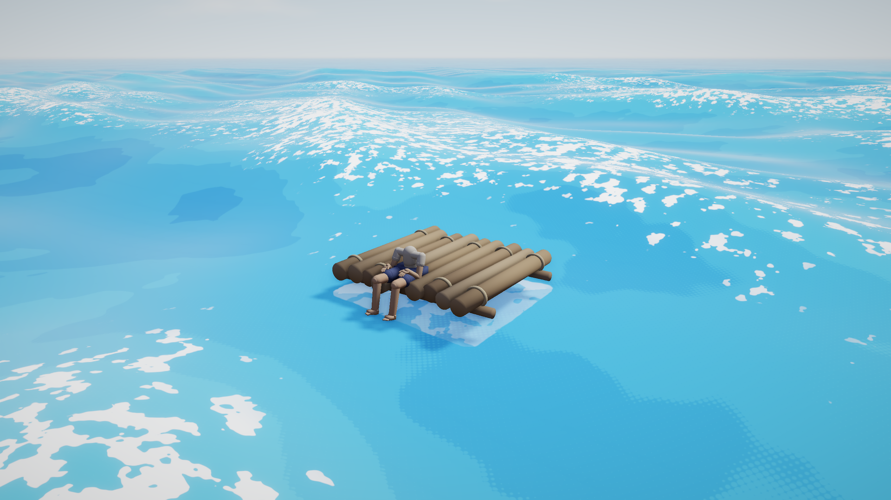

# Ocean

Flint renders an endless, physically-grounded ocean: a sum of Gerstner waves
shaped by a JONSWAP wind-sea spectrum, drawn on a camera-following grid and
shaded in hard cel bands. The waves are believable — real dispersion, real
directional spread — while the *look* stays graphic.



*Flat bold blues, hard-edged white foam. The wave physics is real; the shading
is a woodblock print.*

Add one `ocean` component to a scene and you have a horizon-to-horizon sea:

```toml
[entities.ocean]
[entities.ocean.ocean]
seed = 7
num_waves = 12
wavelength_min = 5.0
wavelength_max = 70.0
amplitude = 0.85
choppiness = 0.7
wind_speed = 7.0
fetch_km = 60.0
```

One ocean per scene. The grid follows the camera, so there is no world size to
configure and no edge to sail off.

## The parity contract

This is the single most important thing to know about the ocean.

**`flint-core/src/ocean.rs` is the sole source of truth for wave math.** It
builds the wave array on the CPU, and the GPU only *sums the array it is
given* — `ocean_shader.wgsl` contains no spectrum logic of its own. That is
what lets a script ask `ocean_height(x, z)` and get the same answer the
renderer drew, which is what buoyancy, splash detection and camera work all
depend on.

If you change the wave math, CPU and GPU must move together. Two guards exist:

- `gpu_packing_matches_cpu_evaluation` in `flint-core` asserts the packed GPU
  layout evaluates to the CPU result.
- A `wave_probe` script pinning a visible buoy to `ocean_height` will visibly
  detach from the surface the moment parity breaks.

A related trap: **wave phase is precomputed per frame in `f64` on the CPU and
uploaded.** Never accumulate phase in `f32` in the shader — over a long
session it drifts and the sea starts to shimmer.

## The spectrum

Waves are not chosen by hand. You describe a sea state and the spectrum
generates the wave set.

| Field | Meaning |
|-------|---------|
| `seed` | Spectrum RNG seed. Same seed, same ocean, forever. |
| `num_waves` | 1–16 Gerstner waves summed. |
| `wavelength_min` / `wavelength_max` | The band the spectrum samples, in meters. |
| `amplitude` | Total wave amplitude (max crest height) in meters. |
| `choppiness` | 0 = rolling swells, 1 = sharp trochoidal crests. |
| `direction_deg` / `spread_deg` | Primary travel direction and directional spread. Short waves wander further off-axis than long ones. |
| `speed_scale` | Time multiplier. 0 freezes the sea without flattening it. |
| `wind_speed` | Wind in m/s — moves the JONSWAP energy peak. |
| `fetch_km` | How far the wind has blown over open water. Longer fetch puts energy into longer swell. |
| `peak_enhancement` | JONSWAP gamma. 1 = broad confused sea, 3.3 = typical, higher = one narrow dominant swell. |

Each wave obeys the deep-water dispersion relation, so longer waves genuinely
travel faster. `wind_speed` and `fetch_km` are the expressive controls: raising
both moves energy into long swell and gives you an ocean that *feels* like it
has weather behind it.

### Phase-safe fields

If you animate the ocean at runtime (a weather system, say), only some fields
can change without visibly popping the sea:

- **Safe to ramp:** `amplitude`, `choppiness`, `wind_speed`, `fetch_km`.
  Regenerating the spectrum preserves existing wave phases.
- **Load-time only:** `direction_deg`, `spread_deg`, `seed`, `speed_scale`, and
  the wavelength band. Changing these re-rolls the wave set and the surface
  jumps.

Pick a wavelength band wide enough at load time to cover every sea state you
intend to reach, then move energy *within* it with wind and fetch.

## Shading

The fragment shader is deliberately not a water shader in the photoreal sense.
Lighting is quantized into `ramp_steps` hard bands, and foam is a hard-edged
mask rather than a soft blend.

| Field | Effect |
|-------|--------|
| `deep_color` / `shallow_color` | Water in wave shadow / in full light. |
| `foam_color` | Crest foam. |
| `sss_color` | Fake subsurface glow through backlit wave flanks. |
| `foam_threshold` | Jacobian threshold — higher makes more foam. |
| `foam_noise_scale` | World-space frequency of foam breakup. |
| `ramp_steps` | Cel bands in the diffuse ramp (1–8). |
| `specular_strength` | Sun glint. The glint is Fresnel-weighted, so it does not smear into a white disc under the camera. |
| `band_wobble` | Noise on the band contours. 0 gives razor edges; a little wobble stops them reading as machine-made. |
| `band_dither` / `band_dither_scale` | Halftone dot transition at band edges, in dots per meter. |

Foam comes from the **Jacobian** of the Gerstner displacement — that is, from
where the surface is actually compressing toward a breaking crest. It is a
physical quantity, not a height threshold, which is why the foam sits where
foam belongs even in a confused sea.

The ocean **writes depth**, so scene fog applies to it correctly. It also fogs
*itself* to the scene fog color before the composite's sky cutoff, otherwise
the far water would render as an unfogged dark band at the horizon.

### Bioluminescence

`foam_glow` (0 = off) makes foam emissive in `foam_glow_color`. Drive it from a
time-of-day script to get plankton bloom nights where the wake lights up.

### Contact foam

Give any entity an `ocean_contact` component and the ocean grows a splash ring
around its hull:

```toml
[entities.boat.ocean_contact]
half_x = 1.2
half_z = 1.15
```

The renderer tracks the hull's center, yaw and extents, differentiates its
position for velocity, and the shader computes churn from *the water's orbital
velocity relative to the hull, projected into the nearest hull face*. A flat
sea stays quiet, the lee side stays quiet, and the windward face flares.

| Field | Effect |
|-------|--------|
| `splash_strength` | Overall gain; 0 disables. |
| `splash_width` | Max foam band width outward from the hull, in meters. |
| `splash_baseline` | Churn floor on calm water. 0 makes foam vanish when flat. |
| `splash_response` | Impact speed → churn gain (s/m). |
| `splash_flicker_speed` / `splash_noise_scale` | Lapping rate and scalloped-edge frequency. |

On genuinely glassy water, set `splash_baseline = 0` — a foam ring hugging a
motionless hull on a mirror reads as a bug.

### Rain

`rain_ripple` (0..1) scatters expanding impact rings across the surface,
hashed on a world-space grid and scanned over a 3×3 cell neighborhood so rings
crossing cell boundaries do not tile into visible squares. They fade out by
~30 m. Drive it from the same weather signal that drives your rain particles.

## Water clarity

With post-processing enabled the ocean does a grab pass and refracts whatever
is underwater:

| Field | Effect |
|-------|--------|
| `turbidity` | 0 = glass-clear, high = murk within half a meter. |
| `refraction_strength` | Screen-space distortion of submerged geometry. |
| `absorption_color` | Per-channel absorption rate. Red dies first in seawater. |
| `sky_reflection_strength` | Fresnel-weighted analytic sky reflection. Needs a `sky` component. |

The sky reflection is a snapshot of the procedural sky's gradient, so
reflections track the time of day for free. It deliberately contains **no sun
disc** — the cel specular already *is* the sun's reflection, and including it
here would draw two suns.

Surfaces seen from below flip their normal and drop both sky reflection and
specular, so the underside of the water reads as water rather than as an opaque
mirror of the sky.

## The grid

| Field | Effect |
|-------|--------|
| `grid_scale` | Inner metric scale of the camera-following grid, in meters. |
| `fade_start` / `fade_end` | Where wave displacement starts fading and where the ocean goes flat. |

The mesh is a normalized grid, radially warped so the center has sub-meter
cells and the rim reaches kilometers — past the geometric horizon at eye
height, so the water's edge is never visible. It follows the camera snapped to
inner-cell multiples, which keeps waves world-anchored instead of swimming
with the view.

## Querying the ocean from scripts

```rhai
let h  = ocean_height(x, z);        // Eulerian surface height (m)
let v  = ocean_velocity_y(x, z);    // vertical surface velocity (m/s)
let n  = ocean_normal(x, z);        // #{x, y, z} surface normal
```

`ocean_height` is what buoyancy is built on — sample it at a few points under a
hull and drive the transform from the result:

```rhai
fn on_update() {
    let me = entity();
    let p = get_field(me, "transform", "position");
    let h = ocean_height(p.x, p.z);
    // ... ease the hull toward h, tilt from ocean_normal ...
}
```

`ocean_velocity_y` is the analytic ∂h/∂t, not a finite difference, and it is
the signal you want for impact cues: the *relative approach speed* between
water and hull tells you how hard a wave struck, which is what separates a lap
from a slam.

Sampling is cheap enough for a handful of probes per frame. It is not cheap
enough for thousands.

## Debugging

The **Ocean Debug** panel (`F3` in the player) exposes the whole component
live — spectrum, colors, foam, contact foam, band edges, clarity, grid — and
**Commit to File** writes your tuning back into the scene TOML.

`show_probe` parks a bright buoy on the surface as a standing CPU/GPU parity
check.

Headless:

```bash
flint render scene.toml --schemas schemas --width 2560 --height 1440 --no-grid \
  --distance 9 --pitch 18 --yaw 35 --target 0,0.4,0
```

Note that `flint render` runs **no scripts**. If your hull floats by script,
it will render at its authored transform rather than on the water — frame
around it, or bake a fixture scene with the values you want.

## See also

- [Sky](sky.md) — the procedural sky the ocean reflects
- [Post-Processing](post-processing.md) — including underwater render mode 5
- [Scripting](scripting.md) — the full Rhai API
