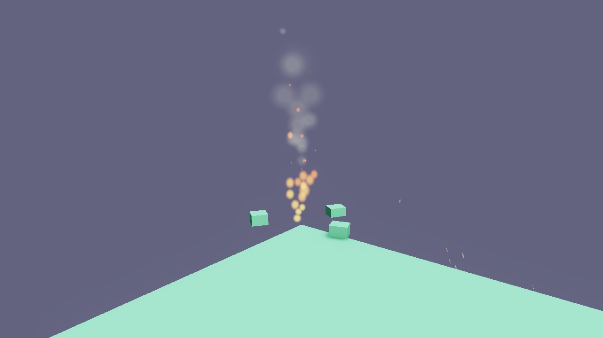

# Particles

Flint's particle system (`flint-particles`) provides GPU-instanced visual effects: fire, smoke, sparks, rain, dust, magic — any effect made of hundreds or thousands of small, short-lived elements. Since ADR 0068 it has two authoring paths, a deterministic simulation that headless renders can step, and its own editor.



## Two Ways to Author

| | Inline `particle_emitter` | Effect asset + `particle_effect` |
|---|---|---|
| Where it lives | On a scene entity | `particles/<name>.particles.toml` next to the scene (or one level up) |
| Emitters | One | Any number, simulated together |
| Curves, forces, bursts timeline, sub-emitters | No (start/end values only) | Yes |
| Reuse | Copy the block | Reference by name from any scene; `play_effect` from scripts |
| Editor | Scene inspector | `flint edit fx.particles.toml` — see the [Particle Editor guide](../guides/particle-editor.md) |

Both paths share one parser and one set of defaults, so anything an inline emitter accepts, an asset emitter accepts too.

### Inline emitter

```toml
[entities.campfire]
[entities.campfire.transform]
position = [0, 0.2, 0]

[entities.campfire.particle_emitter]
emission_rate = 40.0
max_particles = 200
lifetime_min = 0.3
lifetime_max = 0.8
speed_min = 1.5
speed_max = 3.0
direction = [0, 1, 0]
spread = 20.0
gravity = [0, 2.0, 0]
size_start = 0.15
size_end = 0.02
color_start = [1.0, 0.7, 0.1, 0.9]
color_end = [1.0, 0.1, 0.0, 0.0]
blend_mode = "additive"
shape = "sphere"
shape_radius = 0.15
```

### Effect asset

`demo/particles/campfire.particles.toml`, trimmed:

```toml
name = "campfire"
seed = 7

[[emitters]]
name = "flames"
emission_rate = 40.0
lifetime = [0.3, 0.8]             # scalar or [min, max]
speed = [1.5, 3.0]
gravity = [0, 2.0, 0]
blend_mode = "additive"
size = { keys = [ { t = 0.0, v = [0.12, 0.12] }, { t = 0.3, v = [0.16, 0.2] }, { t = 1.0, v = [0.02, 0.02] } ], interp = "smooth" }
color = { keys = [ { t = 0.0, v = [1.0, 0.7, 0.1, 0.9] }, { t = 0.6, v = [1.0, 0.25, 0.0, 0.7] }, { t = 1.0, v = [0.4, 0.0, 0.0, 0.0] } ] }
angular_velocity = [-90, 90]

[emitters.shape]
kind = "cone"
radius = 0.15
angle = 10.0

[[emitters.forces]]
kind = "noise"
strength = 1.2

[[emitters]]
name = "embers"
emission_rate = 0.0
lifetime = [1.0, 2.5]
on_death = { emitter = "puff", count = 1, inherit_velocity = 0.2 }

[[emitters.bursts]]
time = 0.0
count = [3, 6]
cycles = 0          # 0 = repeat forever
interval = 1.5

[[emitters]]
name = "puff"       # rate 0: only ever fed by dying embers
emission_rate = 0.0
lifetime = 0.4
```

Place it in a scene:

```toml
[entities.fire]
[entities.fire.transform]
position = [0, 0.15, 0]
[entities.fire.particle_effect]
effect = "campfire"
```

Unknown keys in an asset are a load error (typos fail loudly); inline components stay lenient. A missing `name` falls back to the file stem.

## How It Works

```
authoring                  simulation (CPU)                     rendering (GPU)
particle_emitter  ─┐                                          ParticlePipeline
particle_effect   ─┼─► EffectInstance ─► EmitterState pool ─► one shared 64-byte
*.particles.toml  ─┘   (transform,      spawn / forces /      instance buffer,
                        seed, budget)    curves / kill         sorted draw calls
```

Each effect instance owns one pool per emitter. Particles are integrated on the CPU (gravity, exponential damping, forces, curves) and packed into a single shared storage buffer; the renderer issues one instanced draw per emitter, order-dependent blends far-to-near, additive last. Nothing is an ECS entity, so an emitter can own thousands of particles cheaply.

The simulation is **deterministic**: every emitter has its own RNG seeded from the effect seed, the owning entity's name and the emitter index, instances step in a fixed order, and `flint render --particle-time` advances in fixed 1/60 s steps. Two renders at the same time are byte-identical, which is what makes particle work reviewable by agents.

## Ranges and Curves

Asset fields that vary over a particle's life or per particle accept several spellings:

| Spelling | Meaning |
|---|---|
| `lifetime = 1.0` | Constant |
| `lifetime = [0.5, 1.5]` | Random in the range at birth |
| `size = 0.2` | Constant over life (per-axis values use `[w, h]`) |
| `size = { start = [0.1, 0.1], end = [0, 0] }` | Linear ramp |
| `size = { keys = [ { t = 0.0, v = ... }, { t = 0.3, v = ... } ], interp = "smooth" }` | Multi-key curve; `interp` is `linear`, `smooth` or `step` |

Over-lifetime curves: `size` (`[w, h]`), `color` (RGBA), `alpha` (multiplies colour alpha), `speed_curve` (multiplies velocity). Per-particle random ranges: `size_scale`, `brightness`, `rotation` (degrees), `angular_velocity` (degrees per second). Legacy inline keys (`lifetime_min`/`max`, `speed_min`/`max`, scalar `size_start`/`size_end`, `color_start`/`color_end`, `burst_count`) still work and fold into these.

## Emission Shapes

| Shape | Asset form | Inline form |
|---|---|---|
| `point` | `shape = { kind = "point" }` | `shape = "point"` |
| `sphere` | `{ kind = "sphere", radius = 0.5 }` | `shape = "sphere"`, `shape_radius` |
| `cone` | `{ kind = "cone", radius = 0.15, angle = 10 }` — spawns on a disc of `radius` perpendicular to `direction`, moving within `angle` degrees | `shape = "cone"`, `shape_angle`, `shape_radius` (cones spawn from a point unless set) |
| `box` | `{ kind = "box", extents = [x, y, z] }` | `shape = "box"`, `shape_extents` |

`shape_offset` translates the spawn region relative to the emitter. `shape_axis_u` / `shape_axis_v` orient a box (ADR 0061): `extents.x` runs along `u`, `extents.y` along `v`, `extents.z` along their cross product; zero or parallel axes fall back to axis-aligned.

`local_axes` decides whether `direction`, `shape_offset` and the shape axes rotate with the entity's world rotation (and scale with its scale). Assets default to `true`; inline components default to `false` so existing scripts that drive `shape_axis_u` in world space (the prologue flight trails) keep working.

## Motion and Forces

Every particle feels `gravity` and exponential `damping` (frame-rate independent). `inherit_velocity` adds a fraction of the emitter's own velocity at birth; `emission_per_meter` spawns particles along the emitter's path as it moves (trails), and rate emission interpolates spawn positions across the frame so a fast emitter leaves a continuous stream rather than clumps.

Asset emitters can add `[[emitters.forces]]`:

| `kind` | Fields | Effect |
|---|---|---|
| `wind` | `velocity`, `strength` | Pulls velocity toward `velocity` at `strength` per second |
| `drag` | `coefficient` | Quadratic drag |
| `noise` | `strength`, `frequency`, `speed`, `octaves` | Deterministic turbulence field |
| `vortex` | `center`, `axis`, `strength`, `falloff` | Swirl around an axis through `center` (relative to the emitter) |
| `attractor` | `position`, `strength`, `radius` | Accelerate toward (or, with negative strength, away from) a point |

## Bursts

`[[emitters.bursts]]` entries fire `count` particles (scalar or `[min, max]`) at `time` seconds into the emitter's timeline, then every `interval` for `cycles` repeats (`0` = forever, with `probability` per firing). The timeline restarts when a looping `duration` wraps, so a burst at `time = 0` with `duration = 1.5` is a metronome. `start_delay` holds emission after play begins. The legacy inline `burst_count` is a single burst at `t = 0`.

## Sub-emitters

`on_death = { emitter = "puff", count = 1, inherit_velocity = 0.2 }` spawns into a sibling emitter where each particle dies; `on_birth` does the same at spawn. Targets are resolved by name inside the effect, self-targeting is rejected, and chains are bounded to one hop per frame with the global budget applied, so an effect cannot run away.

## Rendering

| Field | Notes |
|---|---|
| `blend_mode` | `alpha`, `additive`, `premultiplied`, `multiply` |
| `sort` | `none`, `back_to_front` (correct alpha), `youngest_first`, `oldest_first` — per emitter, using the camera position |
| `texture` | Sprite image, searched in `particles/`, the scene dir, then its parent. Empty draws a procedural soft disc |
| `frames_x`, `frames_y`, `animate_frames`, `frame_rate`, `random_start_frame` | Sprite sheets: frames follow lifetime, or run at `frame_rate` fps, optionally from a random start frame |
| `stretch` | Velocity-aligned billboard stretch in seconds (rain streaks ~0.03) |
| `soft_distance`, `fade_near`, `fade_far`, `lighting`, `fog` | Parsed and saved now; the soft-particle / fade pass is scheduled with the depth-grab work |

Particles are unlit and draw after transparents, before the wireframe overlay. Emitters whose blend mode is order-dependent are drawn far-to-near by emitter distance; additive emitters last.

## Budget and Performance

The system keeps a global alive cap (default 100 000; the F3 Particles panel exposes it) and an optional per-effect `budget`. Each emitter's `max_particles` is capped at 10 000. Instance data is uploaded with one `write_buffer` per frame into a buffer that grows on demand, and component TOML is re-parsed only when it changes.

## Component Schema

### `particle_effect`

| Field | Type | Default | Description |
|---|---|---|---|
| `effect` | string | "" | Effect name (`name` field or file stem of a `particles/*.particles.toml`) |
| `playing` / `autoplay` | bool | false / true | Playback state; `start_emitter` / `stop_emitter` toggle `playing` |
| `scale` | f32 | 1.0 | Multiplies size, speed and shape distances |
| `emission_scale` | f32 | 1.0 | Multiplies every emitter's rate |
| `seed` | i32 | 0 | RNG seed override (0 = derive from the effect seed and this entity) |

### `particle_emitter`

| Field | Type | Default | Description |
|---|---|---|---|
| `emission_rate` | f32 | 10.0 | Particles per second (0 = burst-only) |
| `emission_per_meter` | f32 | 0.0 | Particles per metre of emitter travel |
| `burst_count` | i32 | 0 | Particles fired on play/loop start |
| `max_particles` | i32 | 256 | Pool capacity (max 10,000) |
| `lifetime_min` / `lifetime_max` | f32 | 1.0 / 2.0 | Particle lifetime range in seconds |
| `speed_min` / `speed_max` | f32 | 1.0 / 3.0 | Initial speed range |
| `direction` | vec3 | [0,1,0] | Base emission direction |
| `spread` | f32 | 15.0 | Random deviation angle in degrees |
| `gravity` | vec3 | [0,-9.81,0] | Acceleration |
| `damping` | f32 | 0.0 | Exponential velocity decay per second |
| `inherit_velocity` | f32 | 0.0 | Fraction of emitter velocity added at birth |
| `size_start` / `size_end` | f32 | 0.1 / 0.0 | Size at birth / death |
| `color_start` / `color_end` | vec4 | [1,1,1,1] / [1,1,1,0] | RGBA at birth / death |
| `rotation_min` / `rotation_max` | f32 | 0 / 360 | Initial rotation range, degrees |
| `angular_velocity_min` / `angular_velocity_max` | f32 | 0 / 0 | Spin range, degrees per second |
| `texture` | string | "" | Sprite texture (empty = soft disc) |
| `stretch` | f32 | 0.0 | Velocity-aligned billboard stretch, seconds |
| `frames_x` / `frames_y` | i32 | 1 / 1 | Sprite sheet columns / rows |
| `animate_frames` | bool | false | Advance frames over lifetime |
| `frame_rate` | f32 | 0.0 | Frames per second (0 = follow `animate_frames`) |
| `random_start_frame` | bool | false | Random starting frame per particle |
| `blend_mode` | string | "alpha" | `alpha`, `additive`, `premultiplied`, `multiply` |
| `sort` | string | "none" | `none`, `back_to_front`, `youngest_first`, `oldest_first` |
| `shape` | string | "point" | `point`, `sphere`, `cone`, `box` |
| `shape_radius` | f32 | 0.5 | Sphere radius; cone spawn-disc radius |
| `shape_angle` | f32 | 30.0 | Cone half-angle, degrees |
| `shape_extents` | vec3 | [0.5,0.5,0.5] | Box half-extents |
| `shape_offset` | vec3 | [0,0,0] | Spawn-region translation relative to the emitter |
| `shape_axis_u` / `shape_axis_v` | vec3 | [0,0,0] | Box orientation (zero = axis-aligned) |
| `local_axes` | bool | false | Rotate direction and shape axes with the entity |
| `world_space` | bool | true | `true`: particles stay where born. `false`: they ride with the emitter |
| `duration` | f32 | 0.0 | Emitter duration (0 = infinite) |
| `looping` | bool | true | Loop when duration expires |
| `start_delay` | f32 | 0.0 | Seconds before emission begins |
| `playing` / `autoplay` | bool | false / true | Playback state |
| `soft_distance`, `fade_near`, `fade_far` | f32 | 0 | Reserved for the soft-particle pass |

### Live Fields

The particle system fingerprints each component and re-resolves it only when the TOML actually changes, so a script can retune a running emitter with `set_field` on any field. Changes to `max_particles` rebuild the pool; everything else applies without restarting. Changing `playing` or `autoplay` starts (resetting the emitter clock and burst timeline) or stops the emitter.

## Scripting Integration

| Function | Description |
|----------|-------------|
| `emit_burst(entity_id, count)` | Fire N particles now on every emitter of the entity's effect |
| `start_emitter(entity_id)` / `stop_emitter(entity_id)` | Set `playing` on the component (works for both component kinds) |
| `set_emission_rate(entity_id, rate)` | Change an inline emitter's rate |
| `play_effect(name, x, y, z)` | Spawn a detached one-shot instance of a registered effect; returns a handle |
| `stop_effect(handle)` | Stop emission; particles in flight finish and the instance is removed when empty |
| `set_effect_param(handle, param, value)` | `emission_scale`, `scale`, `playing` (> 0.5), or `x` / `y` / `z` to move it |

```rust
// Rhai: sparks where the hammer lands, a puff of dust that follows the cart
fn on_collision() {
    let me = self_entity();
    let p = get_position(me);
    play_effect("impact_sparks", p.x, p.y, p.z);
}

fn on_init() {
    let p = get_position(self_entity());
    let dust = play_effect("cart_dust", p.x, p.y, p.z);
    set_field(self_entity(), "cart_state", "dust", dust);
}

fn on_update() {
    let dust = get_field(self_entity(), "cart_state", "dust");
    let p = get_position(self_entity());
    set_effect_param(dust, "x", p.x);
    set_effect_param(dust, "z", p.z);
}
```

## Headless Verification

`flint render scene.scene.toml --particle-time 2.0` steps every emitter and effect for two seconds at 1/60 s before capturing, so the frame shows an established effect rather than an empty emitter. Without the flag no particles are simulated and existing snapshots are unchanged. The editor's `flint edit fx.particles.toml --render out.png --anim-time 1.5` does the same for one asset in isolation.

## Architecture

- **`effect.rs`** — the authored `ParticleEffect` / `EmitterDef` (serde), lenient scalar-or-range spellings, `resolve()` into the runtime `EmitterConfig`
- **`sim.rs`** — spawning, forces, curves, bursts, sub-emitter requests; operates on one emitter and a read-only frame, which is the seam a future GPU compute path would replace
- **`sync.rs`** — `EffectInstance` per entity (or detached handle), world sync with fingerprints, deterministic packing and per-emitter sorting
- **`ParticleSystem`** — the `RuntimeSystem`; `step`, `simulate_to`, `pack`
- **`flint-render` `scene_renderer/particles.rs`** — the single upload bridge used by the player, viewer, editor and `flint render`; four blend pipelines over one shared instance buffer

Deferred by ADR 0068: GPU compute simulation, ribbons/trails (the `trail` key is reserved), mesh particles, soft particles and distance fade, collision.

## Recipes

The four editor presets are the maintained recipes: `flint edit new.particles.toml --preset fire|smoke|sparks|rain` writes one to disk and opens it. The inline equivalents below still work.

### Fire
```toml
emission_rate = 40.0
gravity = [0, 2.0, 0]
color_start = [1.0, 0.7, 0.1, 0.9]
color_end = [1.0, 0.1, 0.0, 0.0]
blend_mode = "additive"
shape = "sphere"
shape_radius = 0.15
```

### Smoke
```toml
emission_rate = 8.0
gravity = [0, 0.5, 0]
damping = 0.3
size_start = 0.1
size_end = 0.6
color_start = [0.4, 0.4, 0.4, 0.3]
color_end = [0.6, 0.6, 0.6, 0.0]
blend_mode = "alpha"
sort = "back_to_front"
```

### Rain

Rain is the case `stretch` exists for. A camera-facing quad makes rain look like falling confetti; a velocity-aligned one makes it look like rain.

```toml
emission_rate = 4000.0
lifetime_min = 1.2
lifetime_max = 1.2
gravity = [0.6, -14.0, 0.0]      # tilt X/Z to slant with the wind
speed_min = 0.0
speed_max = 0.5
size_start = 0.012
size_end = 0.012
color_start = [0.72, 0.78, 0.86, 0.5]
color_end = [0.72, 0.78, 0.86, 0.0]
stretch = 0.03                   # elongate along on-screen motion
shape = "box"
shape_extents = [14.0, 0.5, 14.0]
```

Keep `stretch` small — 0.03 already reads as heavy rain. Attach the emitter to something that follows the camera; budget with `emission_rate × lifetime`; slant by tilting `gravity`; dim the colours to the scene's light, since particles are unlit.

## Further Reading

- [Particle Editor](../guides/particle-editor.md) --- authoring effects interactively
- [Scripting](scripting.md) --- full scripting API including particle functions
- [Debug Panels](../guides/debug-panels.md) --- the F3 Particles panel
- [Rendering](rendering.md) --- the GPU pipeline that draws particles
- [Physics and Runtime](physics-and-runtime.md) --- the game loop that drives particle simulation
