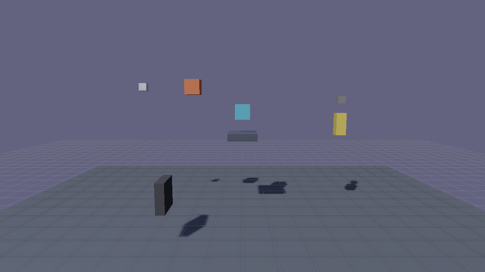

# Physics and Runtime

Flint's runtime layer transforms static scenes into interactive, playable experiences. The `flint-runtime` crate provides the game loop infrastructure, and `flint-physics` integrates the Rapier 3D physics engine for collision detection and character movement.

## The Game Loop

The game loop uses a **fixed-timestep accumulator** pattern. Physics simulation steps at a constant rate (1/60s by default) regardless of how fast or slow the rendering runs. This ensures deterministic behavior across different hardware.

The loop structure:

1. **Tick the clock** --- advance time, accumulate delta into the physics budget
2. **Process input** --- read keyboard and mouse state into `InputState`
3. **Fixed-step physics** --- while enough time has accumulated, step the physics simulation
4. **Character controller** --- apply player movement based on input and physics state
5. **Update audio** --- sync listener position to camera, process trigger events, update spatial tracks
6. **Advance animation** --- tick property tweens and skeletal playback, write updated transforms to ECS, upload bone matrices to GPU
7. **Run scripts** --- execute Rhai scripts (`on_update`, event callbacks), process deferred commands (audio, events)
8. **Render** --- draw the frame with the current entity positions, HUD overlay (crosshair, interaction prompts)

The `RuntimeSystem` trait provides a standard interface for systems that plug into this loop. Physics, audio, animation, and scripting each implement `RuntimeSystem` with `initialize()`, `fixed_update()`, `update()`, and `shutdown()` methods.

## Physics with Rapier 3D

The `flint-physics` crate wraps Rapier 3D and bridges it to Flint's TOML-based component system:

- **PhysicsWorld** --- manages Rapier's rigid body set, collider set, and simulation pipeline
- **PhysicsSync** --- reads `rigidbody` and `collider` components from entities and creates corresponding Rapier bodies. Static bodies for world geometry (walls, floors, furniture), kinematic bodies for the player.
- **CharacterController** --- kinematic first-person movement with gravity, jumping, ground detection, and sprint

## Physics Schemas

Four component schemas define physics properties:

**Rigidbody** (`rigidbody.toml`) --- determines how an entity participates in physics:
- `body_type`: `"static"` (immovable world geometry), `"dynamic"` (simulated), or `"kinematic"` (script-controlled)
- `mass`, `gravity_scale`, `linear_damping`, `angular_damping`
- `mode_2d`: lock to the XY plane (Z = 0, Z rotation only)

**Collider** (`collider.toml`) --- defines the collision shape:
- `shape`: `"box"`, `"sphere"`, `"capsule"`, `"cylinder"` (Y axis, `size = [diameter, height]`), or `"sprite"` (auto-sized from the `sprite` component)
- `size`: dimensions of the collision volume
- `friction`, `restitution`: surface response
- `is_sensor`: detect overlaps without producing contacts
- `offset`, `rotation`: collider pose relative to the entity (added to the `bounds` centre; `rotation = [0, 0, 90]` lays a cylinder on its side as a wheel)

**Joint** (`joint.toml`) --- attaches this entity's body to another with a Rapier impulse joint (see [Joints](#joints)):
- `type`: `"hinge"`, `"prismatic"`, `"spherical"`, or `"fixed"`
- `parent`: entity name to attach to; empty uses the transform parent
- `anchor`, `axis`: pivot and axis in this entity's local frame
- `limits`: `[min, max]` in degrees (hinge/spherical) or metres (prismatic); `min >= max` means free
- `motor_target`, `motor_stiffness`, `motor_damping`, `motor_max_force`, `motor_model`: a position motor that scripts retarget each frame
- `motor_axis`: which angular axis a spherical joint's motor and limits act on
- `contacts_enabled`: let the two jointed bodies collide

**Character Controller** (`character_controller.toml`) --- first-person movement parameters:
- `move_speed`, `jump_force`, `height`, `radius`, `camera_mode`

The **player** archetype (`player.toml`) bundles these together with a `transform` for a ready-to-use player entity.

## Adding Physics to a Scene

To make a scene playable, add physics components to entities:

```toml
# The player entity
[entities.player]
archetype = "player"

[entities.player.transform]
position = [0, 1, 0]

[entities.player.character_controller]
move_speed = 6.0
jump_force = 7.0

# A wall with a static collider
[entities.north_wall]
archetype = "wall"

[entities.north_wall.transform]
position = [0, 2, -10]

[entities.north_wall.collider]
shape = "box"
size = [20, 4, 0.5]

[entities.north_wall.rigidbody]
body_type = "static"
```

Then play the scene:

```bash
flint play my_scene.scene.toml
```

## Joints

Joints (ADR 0069) connect a **dynamic** body to a parent body so that Rapier
supplies the secondary motion --- overshoot, settle, bounce --- while scripts
keep authoring the primary motion. The intended pattern is a hybrid: the root
and most nodes stay kinematic and script-posed, and a few nodes (a folding
rear section, a hydraulic piston, a driver pod on a gimbal) become dynamic
bodies jointed to their kinematic parent. The script writes the joint's
`motor_target` from its own state; physics supplies the rest.

```toml
[entities.rig]
[entities.rig.transform]
position = [0, 3, 0]
[entities.rig.rigidbody]
body_type = "kinematic"          # posed by script with rotate_local()
[entities.rig.collider]
shape = "box"
size = [1.2, 0.3, 1.2]

[entities.piston]
parent = "rig"                   # authored in the rig's local frame
[entities.piston.transform]
position = [0, 1, 0]
[entities.piston.rigidbody]
body_type = "dynamic"
[entities.piston.collider]
shape = "box"
size = [0.6, 0.6, 0.6]
[entities.piston.joint]
type = "prismatic"
axis = [0, 1, 0]
limits = [-0.5, 0.5]
motor_stiffness = 200.0
motor_damping = 10.0
```

```rhai
// each frame: spring the piston toward the script's stroke, in metres
set_joint_target(piston, stroke);
let actual = get_joint_position(piston);   // simulated slide, metres
```

Rules that follow from the implementation:

- **Bodies live in world space.** A rigidbody on a parented entity (including
  the `root__Node__Child` entities a multi-node glTF model expands into) is
  placed from its world matrix, and a dynamic body's simulated pose is written
  back as a local `position` and `rotation_quat` against the parent's world
  matrix. Kinematic bodies follow their world matrix every fixed step, so a
  script posing the root drags jointed children along.
- **Unit scale on the physics chain.** Anchors, axes and collider offsets are
  entity-local only when every entity from the body up to the root has unit
  scale. The engine warns once per entity otherwise.
- **Units are degrees and metres in TOML.** Hinge and spherical targets and
  limits are degrees, prismatic ones metres; the engine converts to Rapier's
  radians internally. `motor_target = 0` is the rest pose the joint was
  created in.
- **The joint is created once**, when both bodies exist (a body added later is
  picked up on the next fixed step), and retargeted in place afterwards: field
  writes to `joint.*` are compared against the last push and only differences
  reach Rapier. Removing either entity removes the joint.
- **Script writes land next frame.** Scripts run after the fixed-physics loop,
  so a target written this frame is applied on the next step.
- `flint render` and the scene viewer do not simulate physics; a `joint`
  component is inert there and the authored rest pose is what renders.

`demo/joint_test.scene.toml` is the reference bench: a hinged pendulum, a
sprung prismatic slider on a yawing kinematic base, a gimballed pod with a
driven spherical motor, and a cylinder wheel.



## Raycasting

The physics system provides raycasting for line-of-sight checks, hitscan weapons, and interaction targeting. `PhysicsWorld::raycast()` casts a ray through the Rapier collision world and returns the first hit:

```rust
pub struct EntityRaycastHit {
    pub entity_id: EntityId,
    pub distance: f32,
    pub point: [f32; 3],
    pub normal: [f32; 3],
}
```

The function resolves Rapier collider handles back to Flint `EntityId`s through the collider-to-entity map maintained by `PhysicsSync`. An optional `exclude_entity` parameter lets callers exclude a specific entity (typically the shooter) from the results.

Raycasting is exposed to scripts via the `raycast()` function --- see [Scripting: Physics API](scripting.md#physics-api) for the script-level interface and examples.

## Input System

The `InputState` struct provides a config-driven, device-agnostic input layer. It tracks keyboard, mouse, and gamepad state each frame and evaluates logical **actions** from physical bindings.

### How It Works

All input flows through a unified `Binding` model:

- **Keyboard keys** (`Key { code }`) --- any winit `KeyCode` name (e.g., `"KeyW"`, `"Space"`, `"ShiftLeft"`)
- **Mouse buttons** (`MouseButton { button }`) --- `"Left"`, `"Right"`, `"Middle"`, `"Back"`, `"Forward"`
- **Mouse delta** (`MouseDelta { axis, scale }`) --- raw mouse movement for camera look
- **Mouse wheel** (`MouseWheel { axis, scale }`) --- scroll wheel input
- **Gamepad buttons** (`GamepadButton { button, gamepad }`) --- any gilrs button name (e.g., `"South"`, `"RightTrigger"`)
- **Gamepad axes** (`GamepadAxis { axis, gamepad, deadzone, scale, invert, threshold, direction }`) --- analog sticks and triggers with full processing pipeline

Actions have two kinds:
- **Button** --- discrete on/off (pressed/released). Any binding value >= 0.5 counts as pressed.
- **Axis1d** --- continuous analog value. All binding values are summed.

### Input Configuration Files

Bindings are defined in TOML files with a layered loading model:

```toml
version = 1
game_id = "doom_fps"

[actions.move_forward]
kind = "button"
[[actions.move_forward.bindings]]
type = "key"
code = "KeyW"
[[actions.move_forward.bindings]]
type = "gamepad_axis"
axis = "LeftStickY"
direction = "negative"
threshold = 0.35
gamepad = "any"

[actions.fire]
kind = "button"
[[actions.fire.bindings]]
type = "mouse_button"
button = "Left"
[[actions.fire.bindings]]
type = "gamepad_button"
button = "RightTrigger"
gamepad = "any"

[actions.look_x]
kind = "axis1d"
[[actions.look_x.bindings]]
type = "mouse_delta"
axis = "x"
scale = 2.0
[[actions.look_x.bindings]]
type = "gamepad_axis"
axis = "RightStickX"
deadzone = 0.15
scale = 1.0
gamepad = "any"
```

### Config Layering

Configs are loaded with deterministic precedence (later layers override earlier):

1. **Engine built-in defaults** --- hardcoded WASD + mouse baseline (always present)
2. **Game default config** --- `<game_root>/config/input.toml` (checked into the repo)
3. **User overrides** --- `~/.flint/input_{game_id}.toml` (per-player remapping, written at runtime)
4. **CLI override** --- `--input-config <path>` flag (one-off testing/debugging)

Scenes can also reference an input config via the `input_config` field in the `[scene]` table.

### Default Action Bindings

When no config files are present, the built-in defaults provide:

| Action | Default Binding | Kind |
|--------|----------------|------|
| `move_forward` | W | Button |
| `move_backward` | S | Button |
| `move_left` | A | Button |
| `move_right` | D | Button |
| `jump` | Space | Button |
| `interact` | E | Button |
| `sprint` | Left Shift | Button |
| `weapon_1` | 1 | Button |
| `weapon_2` | 2 | Button |
| `reload` | R | Button |
| `fire` | Left Mouse Button | Button |

Games can define any number of custom actions in their config files. Scripts access them with `is_action_pressed("custom_action")`.

### Gamepad Support

Gamepad input is handled via the [gilrs](https://gitlab.com/gilrs-project/gilrs) crate. The player polls gamepad events each frame and routes them through the same binding system as keyboard/mouse:

- **Buttons** are matched by gilrs `Debug` names: `South`, `East`, `North`, `West`, `LeftTrigger`, `RightTrigger`, `DPadUp`, etc.
- **Axes** support deadzone filtering, scale, invert, and optional threshold for button-like behavior
- **Multi-gamepad** is supported via `GamepadSelector::Any` (first match) or `GamepadSelector::Index(n)` (specific controller)
- Disconnected gamepads are automatically cleaned up

### Runtime Rebinding

Bindings can be remapped at runtime through the `rebind_action()` API:

1. Call `begin_rebind_capture(action, mode)` to enter capture mode
2. The next physical input (key press, mouse click, or gamepad button/axis) becomes the new binding
3. The mode determines conflict resolution:
   - **Replace** --- clear all existing bindings, set the new one
   - **Add** --- append to the binding list (allows multiple inputs for one action)
   - **Swap** --- remove this binding from any other action, assign to target
4. User overrides are automatically saved to `~/.flint/input_{game_id}.toml`

## Runtime Physics Updates

The physics system handles several runtime updates beyond the core simulation:

- **Sensor flag updates** --- when game logic marks an entity as dead, its collider can be set to a sensor (non-solid) so other entities pass through it
- **Kinematic body sync** --- script-controlled transforms (world matrix, `rotation_quat` honoured) are pushed to Rapier kinematic bodies each fixed step; dynamic bodies write back both `position` and `rotation_quat`
- **Joint retargeting** --- changed `joint.motor_target` / gains / limits are pushed into the live impulse joint each fixed step and the child body is woken
- **Collision event drain** --- the `ChannelEventCollector` collects collision and contact events each physics step; these are drained and dispatched as script callbacks (`on_collision`, `on_trigger_enter`, `on_trigger_exit`)

## Further Reading

- [Scripting](scripting.md) --- Rhai scripting system for game logic
- [Audio](audio.md) --- spatial audio with Kira
- [Animation](animation.md) --- property tweens and skeletal animation
- [Rendering](rendering.md) --- the PBR rendering pipeline
- [Schemas](schemas.md) --- component and archetype definitions including physics schemas
- [CLI Reference](../cli-reference/overview.md) --- the `play` command and player binary
