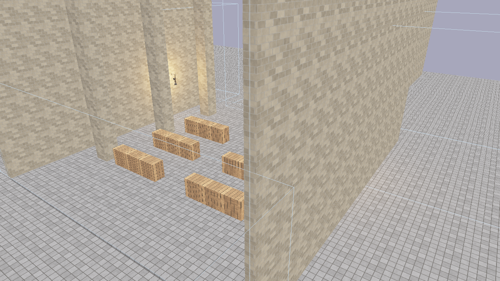
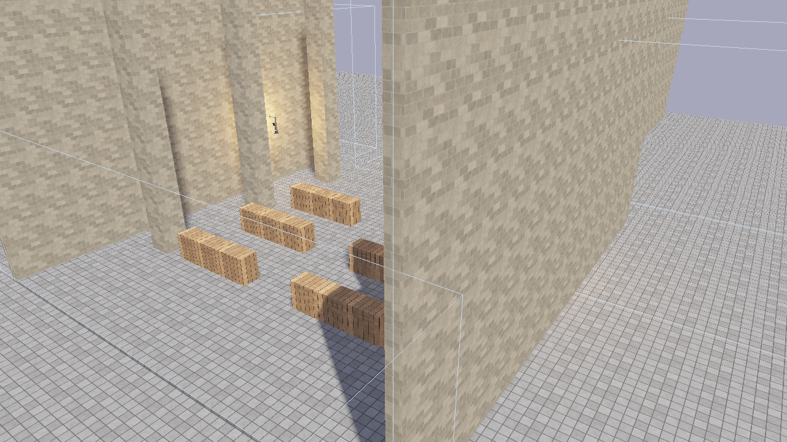

# Post-Processing

Flint includes an HDR post-processing pipeline that transforms the raw scene render into polished final output with bloom, tonemapping, and vignette effects.

## How It Works

Instead of rendering directly to the screen, the scene is drawn to an intermediate **HDR buffer** (`Rgba16Float` format) that can store values brighter than 1.0. A series of fullscreen passes then process this buffer:

```
Scene render         Bloom chain              Composite pass
(PBR, skinned,   →  downsample (5 mips)  →   exposure
 billboard,         upsample (additive)       ACES tonemapping
 particles,                                   gamma correction
 skybox)                                      vignette
     ↓                    ↓                       ↓
 Rgba16Float          bloom texture           sRGB surface
 HDR buffer           (bright halos)          (final output)
```

All scene pipelines --- PBR, skinned mesh, billboard sprite, particle, and skybox --- render to the HDR buffer when post-processing is active. The PBR shader's built-in tonemapping is automatically disabled so it outputs linear HDR values for the composite pass to process.

## Bloom

Bloom creates the soft glow around bright light sources --- emissive materials, fire particles, bright specular highlights. The implementation uses the technique from Call of Duty: Advanced Warfare:

1. **Threshold** --- pixels brighter than `bloom_threshold` are extracted
2. **Downsample** --- a 5-level mip chain progressively halves the resolution using a 13-tap filter
3. **Upsample** --- each mip level is upsampled with a 9-tap tent filter and additively blended back up the chain
4. **Composite** --- the final bloom texture is mixed into the scene at `bloom_intensity` strength



*Post-processing enabled: bloom creates halos around emissive surfaces and bright lights.*



*Post-processing disabled: the same scene rendered with shader-level tonemapping only.*

The mip chain depth is calculated as `floor(log2(min(width, height))) - 3`, capped at 5 levels, ensuring the smallest mip is at least 8x8 pixels.

## Scene Configuration

Add a `[post_process]` block to your scene TOML to configure per-scene settings:

```toml
[post_process]
bloom_enabled = true
bloom_intensity = 0.04
bloom_threshold = 1.0
vignette_enabled = true
vignette_intensity = 0.3
exposure = 1.0
```

| Field | Type | Default | Description |
|-------|------|---------|-------------|
| `bloom_enabled` | bool | `true` | Enable bloom effect |
| `bloom_intensity` | f32 | `0.04` | Bloom mix strength (0.0 = none, higher = more glow) |
| `bloom_threshold` | f32 | `1.0` | Minimum brightness for bloom extraction |
| `vignette_enabled` | bool | `false` | Enable screen-edge darkening |
| `vignette_intensity` | f32 | `0.3` | Vignette darkness (0.0 = none, 1.0 = strong) |
| `exposure` | f32 | `1.0` | Exposure multiplier (higher = brighter overall image) |

## CLI Flags

Override post-processing settings from the command line:

```bash
# Disable all post-processing
flint render scene.toml --no-postprocess

# Adjust bloom
flint render scene.toml --bloom-intensity 0.08 --bloom-threshold 0.8

# Adjust exposure
flint render scene.toml --exposure 1.5

# Combine flags
flint play scene.toml --bloom-intensity 0.1 --exposure 1.2
```

| Flag | Description |
|------|-------------|
| `--no-postprocess` | Disable the entire post-processing pipeline |
| `--bloom-intensity <f32>` | Override bloom intensity |
| `--bloom-threshold <f32>` | Override bloom brightness threshold |
| `--exposure <f32>` | Override exposure multiplier |

CLI flags take precedence over scene TOML settings.

## Runtime Toggles

During gameplay (`flint play`), toggle post-processing effects with keyboard shortcuts:

| Key | Action |
|-----|--------|
| **F5** | Toggle bloom on/off |
| **F6** | Toggle entire post-processing pipeline on/off |

When post-processing is toggled off at runtime, the PBR shader's built-in ACES tonemapping and gamma correction are automatically restored as a fallback path. This means the scene always looks correct regardless of the pipeline state.

## Shader Integration

When the post-processing pipeline is active, the engine sets `enable_tonemapping = 0` in the PBR uniform buffer, forcing shaders to output raw linear HDR values. The composite pass then applies:

1. **Exposure** --- multiplies all color values by the exposure setting
2. **ACES tonemapping** --- maps HDR values to displayable range using the ACES filmic curve
3. **Gamma correction** --- converts linear light to sRGB
4. **Vignette** --- darkens screen edges for a cinematic look

When post-processing is disabled (via `--no-postprocess` or F6), the shader handles tonemapping and gamma internally. This dual-path design ensures backward compatibility with scenes that don't use post-processing.

## Design Decisions

- **Rgba16Float** for the HDR buffer provides sufficient precision for bloom extraction without the memory cost of Rgba32Float
- **Progressive downsample/upsample** (rather than a single Gaussian blur) produces wide, natural-looking bloom cheaply
- **1x1 black fallback texture** when bloom is disabled avoids conditional bind group creation
- **Resize handling** --- `PostProcessResources` are recreated on window resize since the HDR texture and bloom mip chain are resolution-dependent

## Further Reading

- [Rendering](rendering.md) --- the PBR pipeline that feeds into post-processing
- [Headless Rendering](../guides/headless-rendering.md) --- using post-processing flags in CI
- [CLI Reference](../cli-reference/overview.md) --- full command options
- [File Formats](../formats/overview.md) --- the `[post_process]` scene block
