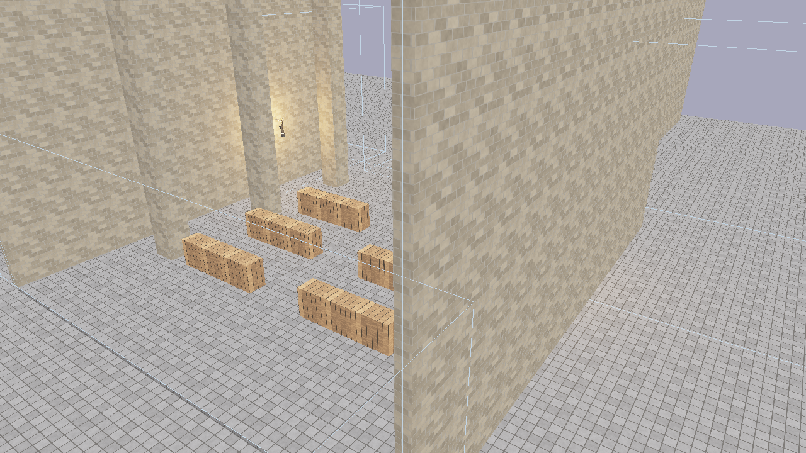
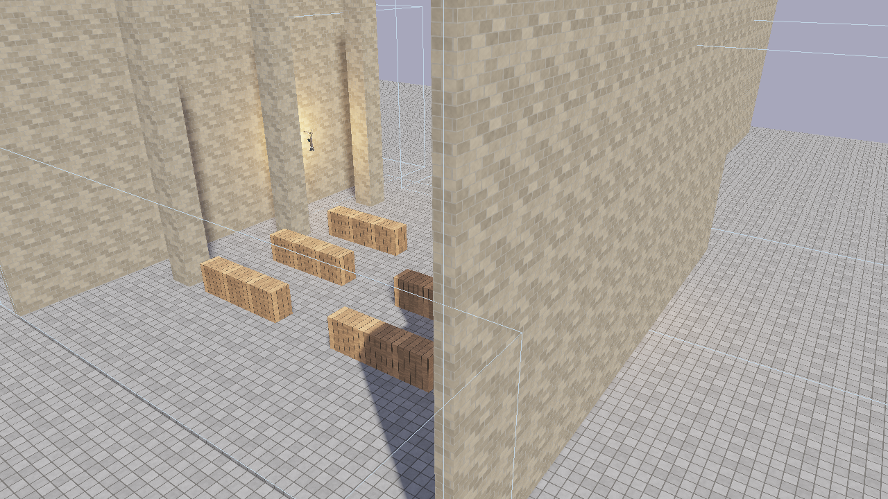
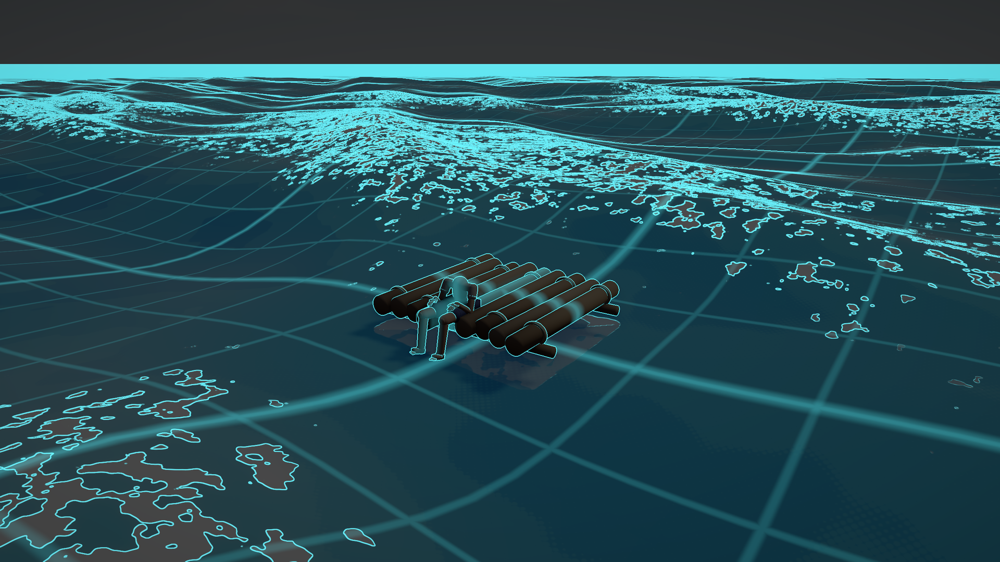

# Post-Processing

Flint includes an HDR post-processing pipeline that transforms the raw scene render into polished final output with bloom, SSAO, fog, volumetric lighting, tonemapping, and vignette effects.

## How It Works

Instead of rendering directly to the screen, the scene is drawn to an intermediate **HDR buffer** (`Rgba16Float` format) that can store values brighter than 1.0. A series of fullscreen passes then process this buffer:

```
Scene render         SSAO        Volumetric    Bloom chain       Composite pass
(PBR, skinned,   →  depth-based  shadow-based  downsample    →   exposure
 billboard,         AO texture   god rays      upsample          ACES tonemapping
 particles,                                                      gamma correction
 skybox)                                                         fog + vignette
     ↓                  ↓            ↓              ↓                ↓
 Rgba16Float       AO texture   vol texture    bloom texture    sRGB surface
 HDR buffer        (darkening)  (light shafts) (bright halos)  (final output)
```

All scene pipelines --- PBR, skinned mesh, billboard sprite, particle, and skybox --- render to the HDR buffer when post-processing is active. The PBR shader's built-in tonemapping is automatically disabled so it outputs linear HDR values for the composite pass to process.

## Bloom

Bloom creates the soft glow around bright light sources --- emissive materials, fire particles, bright specular highlights. The implementation uses the technique from Call of Duty: Advanced Warfare:

1. **Threshold** --- pixels brighter than `bloom_threshold` are extracted
2. **Downsample** --- a 5-level mip chain progressively halves the resolution using a 13-tap filter
3. **Upsample** --- each mip level is upsampled with a 9-tap tent filter and additively blended back up the chain
4. **Composite** --- the final bloom texture is mixed into the scene at `bloom_intensity` strength



*Post-processing enabled: bloom creates halos around emissive surfaces and bright lights.*



*Post-processing disabled: the same scene rendered with shader-level tonemapping only.*

The mip chain depth is calculated as `floor(log2(min(width, height))) - 3`, capped at 5 levels, ensuring the smallest mip is at least 8x8 pixels.

## SSAO (Screen-Space Ambient Occlusion)

SSAO darkens crevices, corners, and areas where surfaces meet, adding depth and realism to a scene without requiring extra light sources. The implementation samples the depth buffer around each pixel to estimate how much ambient light would be blocked by nearby geometry.

| Field | Type | Default | Description |
|-------|------|---------|-------------|
| `ssao_enabled` | bool | `true` | Enable SSAO |
| `ssao_radius` | f32 | `0.5` | Sample radius in world units (larger = wider darkening) |
| `ssao_intensity` | f32 | `1.0` | Occlusion strength (higher = darker crevices) |

## Fog

Distance-based fog blends a configurable fog color into the scene based on pixel depth. Height-based falloff can be layered on top so fog is thicker near the ground and thins out at higher elevations.

| Field | Type | Default | Description |
|-------|------|---------|-------------|
| `fog_enabled` | bool | `false` | Enable distance fog |
| `fog_color` | [f32; 3] | `[0.7, 0.75, 0.82]` | Fog color (linear RGB) |
| `fog_density` | f32 | `0.02` | Exponential density factor |
| `fog_start` | f32 | `5.0` | Distance where fog begins |
| `fog_end` | f32 | `100.0` | Distance where fog reaches full opacity |
| `fog_height_enabled` | bool | `false` | Enable height-based falloff |
| `fog_height_falloff` | f32 | `0.1` | How quickly fog thins with altitude |
| `fog_height_origin` | f32 | `0.0` | World Y where fog is thickest |

## Volumetric Lighting (God Rays)

Volumetric lighting simulates light scattering through participating media (dust, fog, haze), producing visible shafts of light (god rays). The effect ray-marches from each pixel toward the camera, sampling the shadow map at each step to determine whether that point in space is lit or in shadow.

### How it works

1. For each screen pixel, reconstruct its world position from the depth buffer
2. March `volumetric_samples` steps along the view ray from the pixel back toward the camera
3. At each step, project the position into shadow-map space and sample the cascaded shadow map
4. Accumulate light contribution where the sample is not in shadow, applying exponential decay
5. The resulting volumetric texture is additively blended into the scene during the composite pass

Because volumetric lighting depends on the shadow map, it requires at least one directional light with shadows enabled. The effect is disabled when shadows are off.

### Per-light configuration

Each directional light can control its volumetric contribution independently via its `light` component:

```toml
[entities.sun.light]
type = "directional"
direction = [0.4, 0.6, 0.05]
color = [1.0, 0.92, 0.75]
intensity = 6.0
volumetric_intensity = 4.0               # god ray brightness (0 = no rays)
volumetric_color = [1.0, 0.88, 0.6]      # tint for the light shafts
```

| Light field | Type | Default | Description |
|-------------|------|---------|-------------|
| `volumetric_intensity` | f32 | `0.0` | Per-light god ray strength (0 = disabled for this light) |
| `volumetric_color` | [f32; 3] | light color | Tint color for the shafts from this light |

### Global scene settings

The `[post_process]` block controls the overall volumetric pass:

| Field | Type | Default | Description |
|-------|------|---------|-------------|
| `volumetric_enabled` | bool | `false` | Enable volumetric lighting |
| `volumetric_samples` | u32 | `32` | Ray-march steps per pixel (higher = smoother, more expensive) |
| `volumetric_density` | f32 | `1.0` | Scattering density multiplier |
| `volumetric_max_distance` | f32 | `100.0` | Maximum ray-march distance from camera |
| `volumetric_decay` | f32 | `0.98` | Exponential decay per step (closer to 1.0 = shafts extend further) |

### Example: dungeon window

```toml
[post_process]
volumetric_enabled = true
volumetric_samples = 64
volumetric_density = 30.0
volumetric_max_distance = 15.0
volumetric_decay = 0.998
exposure = 2.5

[entities.sun.light]
type = "directional"
direction = [0.4, 0.4, 0.05]
color = [1.0, 0.92, 0.75]
intensity = 6.0
volumetric_intensity = 4.0
volumetric_color = [1.0, 0.88, 0.6]
```

High `volumetric_density` with a short `volumetric_max_distance` and `decay` close to 1.0 produces thick, concentrated shafts --- good for dusty interiors. For outdoor haze, use lower density and longer distance.

## Dither

Subtle dithering reduces color banding in gradients (skies, fog falloff, smooth surfaces). A blue-noise pattern is applied during the composite pass.

| Field | Type | Default | Description |
|-------|------|---------|-------------|
| `dither_enabled` | bool | `false` | Enable dithering |
| `dither_intensity` | f32 | `0.03` | Dither strength (subtle values like 0.02--0.05 work best) |

## Scene Configuration

Add a `[post_process]` block to your scene TOML to configure per-scene settings:

```toml
[post_process]
bloom_enabled = true
bloom_intensity = 0.04
bloom_threshold = 1.0
ssao_enabled = true
ssao_radius = 0.5
ssao_intensity = 1.0
fog_enabled = true
fog_density = 0.02
fog_color = [0.7, 0.75, 0.82]
volumetric_enabled = false
vignette_enabled = true
vignette_intensity = 0.3
exposure = 1.0
```

All fields are optional --- omitted values use their defaults.

## CLI Flags

Override post-processing settings from the command line:

```bash
# Disable all post-processing
flint render scene.toml --no-postprocess

# Adjust bloom
flint render scene.toml --bloom-intensity 0.08 --bloom-threshold 0.8

# Adjust exposure
flint render scene.toml --exposure 1.5

# SSAO
flint render scene.toml --ssao-radius 0.5 --ssao-intensity 1.0

# Fog
flint render scene.toml --fog-density 0.02 --fog-color 0.7,0.75,0.82 --fog-height-falloff 0.1

# Volumetric lighting
flint render scene.toml --volumetric-density 1.0 --volumetric-samples 32

# Dither
flint render scene.toml --dither-intensity 0.03

# Combine flags
flint play scene.toml --bloom-intensity 0.1 --exposure 1.2 --volumetric-density 5.0
```

| Flag | Description |
|------|-------------|
| `--no-postprocess` | Disable the entire post-processing pipeline |
| `--no-shadows` | Disable shadow mapping (also disables volumetric) |
| `--bloom-intensity <f32>` | Override bloom intensity |
| `--bloom-threshold <f32>` | Override bloom brightness threshold |
| `--exposure <f32>` | Override exposure multiplier |
| `--ssao-radius <f32>` | Override SSAO sample radius |
| `--ssao-intensity <f32>` | Override SSAO strength |
| `--fog-density <f32>` | Override fog density (0 disables fog) |
| `--fog-color <r,g,b>` | Override fog color |
| `--fog-height-falloff <f32>` | Enable height fog with given falloff |
| `--volumetric-density <f32>` | Override volumetric density (0 disables) |
| `--volumetric-samples <u32>` | Override volumetric ray-march steps |
| `--dither-intensity <f32>` | Override dither strength |

CLI flags take precedence over scene TOML settings.

## Runtime Toggles

During gameplay (`flint play` / `flint edit`), toggle post-processing effects with keyboard shortcuts:

| Key | Action |
|-----|--------|
| **F5** | Toggle bloom on/off |
| **F6** | Toggle entire post-processing pipeline on/off |
| **F7** | Toggle SSAO on/off |
| **F8** | Toggle fog on/off |
| **F9** | Toggle dither on/off |
| **F10** | Toggle volumetric lighting on/off |

When post-processing is toggled off at runtime, the PBR shader's built-in ACES tonemapping and gamma correction are automatically restored as a fallback path. This means the scene always looks correct regardless of the pipeline state.

## Shader Integration

When the post-processing pipeline is active, the engine sets `enable_tonemapping = 0` in the PBR uniform buffer, forcing shaders to output raw linear HDR values. The composite pass then applies:

1. **SSAO** --- darkens ambient-occluded areas using the AO texture
2. **Volumetric** --- additively blends god ray light shafts
3. **Exposure** --- multiplies all color values by the exposure setting
4. **ACES tonemapping** --- maps HDR values to displayable range using the ACES filmic curve
5. **Fog** --- blends fog color based on depth and optional height falloff
6. **Gamma correction** --- converts linear light to sRGB
7. **Dither** --- applies subtle noise to reduce banding
8. **Vignette** --- darkens screen edges for a cinematic look

When post-processing is disabled (via `--no-postprocess` or F6), the shader handles tonemapping and gamma internally. This dual-path design ensures backward compatibility with scenes that don't use post-processing.

## Render Modes

Render modes are whole-screen stylizations that branch **after ACES tonemapping
and before vignette**. They are not debug views: they are a supported way to
make the world visibly stop being itself for a while.



*Mode 4 over an ocean scene: depth-reconstructed world grid, Sobel edges on
depth and luminance.*

| Mode | Name | What it does |
|------|------|--------------|
| 0 | None | Normal output. |
| 1 | Matrix | Procedural dot-matrix glyphs per 8×12 px cell. Brightness *and* density track scene luminance, with per-column rain heads. |
| 2 | Blood | Palette remap. Ocean scenes recolor through the ocean shader too, so the water is genuinely a different sea rather than a red filter over a blue one. |
| 3 | Drunk | Pre-sample UV sway warping the whole composite chain, plus a ghosting double-tap. |
| 4 | Tron | Depth Sobel + luminance edges in cyan over a dimmed scene, with a world-space grid reconstructed from depth so it rides real geometry. |
| 5 | Underwater | Masks per pixel against a **waterline plane**, not a patch mask. Banded murk absorption, a wobbled foam lip on the line, light shafts, Snell-window brightening. |

Four uniforms carry the state: `render_mode`, `mode_mix` (0..1 blend),
`mode_time`, and a `mode_params` vec4 whose meaning is per-mode.

| Mode | `mode_params` |
|------|---------------|
| 1–4 | `x` = bleed-mask scale, `y` = mask style (0 = fbm patches, 1 = radial iris), `z` = rate, `w` = spare |
| 5 | `x` = signed eye depth in meters (+ = submerged), `y` = sea energy 0..1, `z` = daylight 0..1, `w` = bioluminescence 0..1 |

Modes 1–4 fade in through an fbm **bleed mask** whose threshold sweeps across
the noise span, so patch coverage grows with `mode_mix` and pins to full
coverage at 1. Mode 5 ignores the mask entirely — being underwater is a fact
about where your eye is, not a patch that spreads.

### From scripts

```rhai
set_render_mode(4, 0.85);                  // mode, mix
set_render_mode_params(3.0, 0.0, 6.0, 0.0);
```

**`set_render_mode` is transient, and it is the only post-process override that
is.** Every other override — exposure, bloom, fog, chromatic aberration — is
sticky: set it once and it persists. The render mode is zeroed the frame your
script *stops calling it*.

That asymmetry is deliberate. A sticky render mode plus a script that crashed,
hot-reloaded, or was disabled mid-effect would leave the world permanently
inside a hallucination with no way out. Instead, a dead script means a healed
world. The cost is that you must call it every frame the effect is active:

```rhai
fn on_update() {
    let m = current_mix();          // your own envelope
    if m > 0.001 {
        set_render_mode(active_mode, m);
    }
    // stop calling -> the engine restores the world by itself
}
```

Sticky effects a mode borrows (FOV, radial blur, chromatic aberration) are
*not* covered by this, so zero them yourself when your effect ends.

### Headless

```bash
flint render scene.toml --schemas schemas \
  --render-mode 4 --mode-mix 1.0 --mode-params 3,0,6,0
```

Since `flint render` runs no scripts, these flags **are** the fixture — there
is no script to drive the mode for you.

One practical note: modes 1 and 4 key off scene luminance, so they read best
in daylight even if your game schedules them at night. A night scene renders
the Matrix mode nearly black.

## Design Decisions

- **Rgba16Float** for the HDR buffer provides sufficient precision for bloom extraction without the memory cost of Rgba32Float
- **Progressive downsample/upsample** (rather than a single Gaussian blur) produces wide, natural-looking bloom cheaply
- **1x1 black fallback texture** when bloom is disabled avoids conditional bind group creation
- **Resize handling** --- `PostProcessResources` are recreated on window resize since the HDR texture and bloom mip chain are resolution-dependent
- **Extended shadow depth** --- the shadow frustum's depth range is extended beyond the camera frustum so off-screen casters (ceilings, walls behind the camera) are captured in the shadow map, which is critical for correct volumetric shafts in enclosed spaces

## Further Reading

- [Rendering](rendering.md) --- the PBR pipeline that feeds into post-processing
- [Headless Rendering](../guides/headless-rendering.md) --- using post-processing flags in CI
- [CLI Reference](../cli-reference/overview.md) --- full command options
- [File Formats](../formats/overview.md) --- the `[post_process]` scene block
