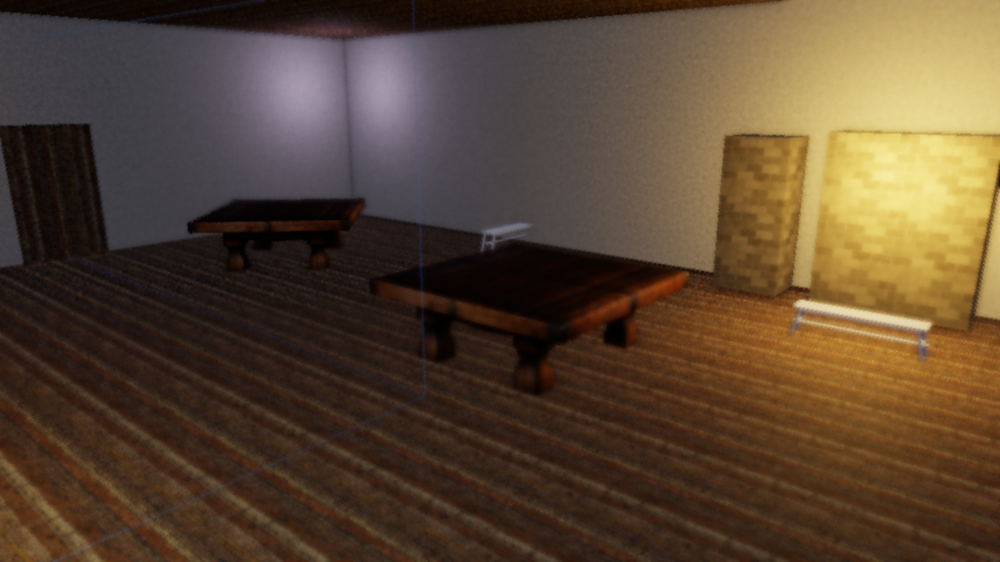
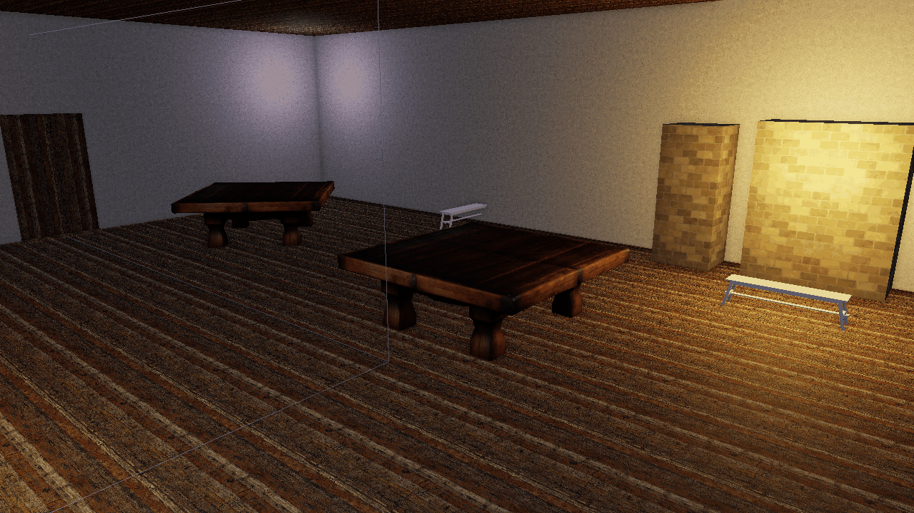
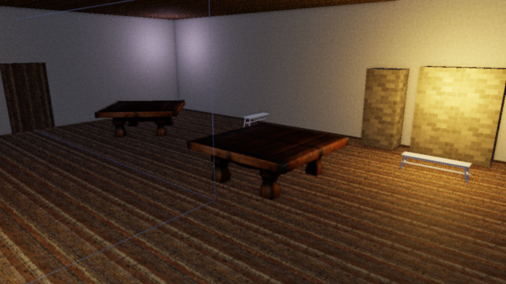
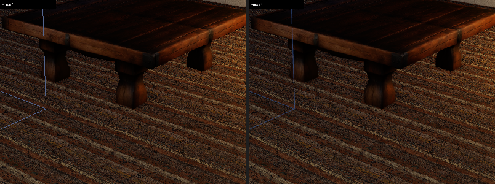
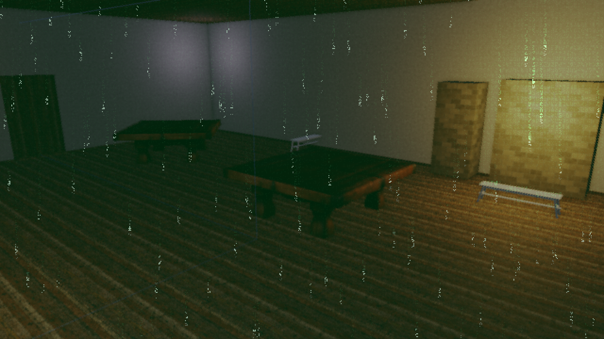
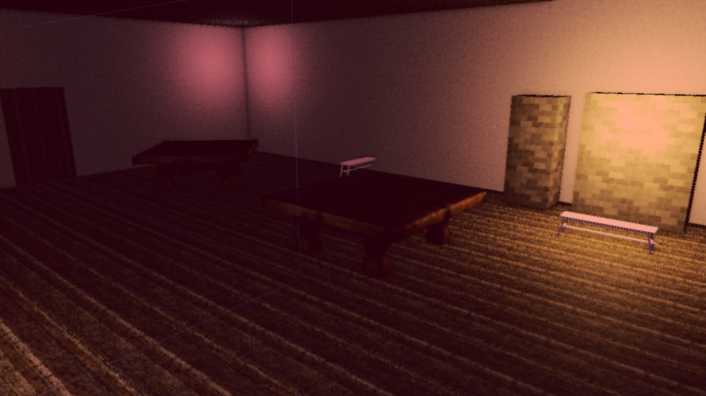
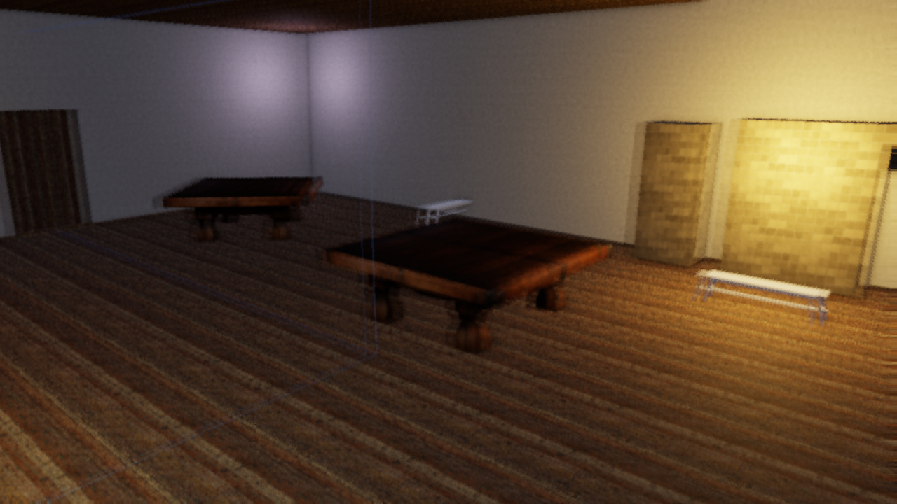

# Post-Processing

Flint includes an HDR post-processing pipeline that transforms the raw scene render into polished final output: bloom, SSAO, fog, volumetric lighting, depth of field, a painterly Kuwahara filter, color grading, film grain, tonemapping, vignette, FXAA, and whole-screen render modes.

## How It Works

Instead of rendering directly to the screen, the scene is drawn to an intermediate **HDR buffer** (`Rgba16Float` format) that can store values brighter than 1.0. A series of fullscreen passes then process this buffer:

```
Scene render        Depth       Kuwahara     SSAO       Volumetric   Bloom chain    Composite pass        FXAA
(PBR, skinned,  ->  resolve  -> (optional -> depth-  -> shadow-   -> downsample  -> DoF, AO, god rays  -> (optional
 billboard,         (MSAA       painterly    based      based        upsample       bloom, fog, exposure    edge AA)
 particles,         sample 0)   pre-pass)    AO         god rays                    ACES, grade, desat,
 sky, ocean,                                                                        render mode, vignette,
 terrain, grass)                                                                    grain, dither
     |                 |            |           |           |            |                |                   |
 Rgba16Float       depth       filtered     AO         vol          bloom          sRGB surface or       sRGB
 HDR buffer        texture     HDR          texture    texture      texture        FXAA intermediate     surface
```

All scene pipelines --- PBR, skinned mesh, billboard sprite, particle, skybox, sky, ocean, terrain and grass --- render to the HDR buffer when post-processing is active. The PBR shader's built-in tonemapping is automatically disabled so it outputs linear HDR values for the composite pass to process. Kuwahara and FXAA resources are only allocated when their effect is enabled.

## Bloom

Bloom creates the soft glow around bright light sources --- emissive materials, fire particles, bright specular highlights. The implementation uses the technique from Call of Duty: Advanced Warfare:

1. **Threshold** --- pixels brighter than `bloom_threshold` are extracted
2. **Downsample** --- a 5-level mip chain progressively halves the resolution using a 13-tap filter
3. **Upsample** --- each mip level is upsampled with a 9-tap tent filter and additively blended back up the chain
4. **Composite** --- the final bloom texture is mixed into the scene at `bloom_intensity` strength


*Post-processing enabled: bloom creates halos around emissive surfaces and bright lights.*


*Post-processing disabled: the same scene rendered with shader-level tonemapping only.*

| Field | Type | Default | Description |
|-------|------|---------|-------------|
| `bloom_enabled` | bool | `true` | Enable bloom |
| `bloom_intensity` | f32 | `0.04` | Mix strength of the bloom texture |
| `bloom_threshold` | f32 | `1.0` | Minimum brightness extracted into the bloom chain |

The mip chain depth is calculated as `floor(log2(min(width, height))) - 3`, capped at 5 levels, ensuring the smallest mip is at least 8x8 pixels.

## SSAO (Screen-Space Ambient Occlusion)

SSAO darkens crevices, corners, and areas where surfaces meet, adding depth and realism to a scene without requiring extra light sources. The implementation samples the depth buffer around each pixel to estimate how much ambient light would be blocked by nearby geometry.

| Field | Type | Default | Description |
|-------|------|---------|-------------|
| `ssao_enabled` | bool | `true` | Enable SSAO |
| `ssao_radius` | f32 | `0.5` | Sample radius in world units (larger = wider darkening) |
| `ssao_intensity` | f32 | `1.0` | Occlusion strength (higher = darker crevices) |
| `ssao_samples` | u32 | `64` | Hemisphere samples per pixel, 1--64 (ADR 0052) |

SSAO is the heaviest per-pixel pass in the post stack. The sample kernel is strided, so lower counts keep full radius coverage; `ssao_samples = 16` is usually indistinguishable on soft matte scenes and roughly four times cheaper. The clay-look demo scenes use 16.

An SSAO depth bias (default `0.025`) is exposed in the Rendering & Effects menu but has no scene key.

## Depth of Field

Depth of field defocuses everything outside a focus band. The composite pass computes a circle of confusion per pixel from the depth buffer and gathers a CoC-weighted disc from the HDR source, so in-focus foreground does not bleed into defocused regions.


*Focus plane at 3 m: the foreground is sharp and the room behind it falls away.*



*Focus plane at 12 m: the same frame with the focus pushed back.*

| Field | Type | Default | Description |
|-------|------|---------|-------------|
| `dof_strength` | f32 | `0.0` | 0 = off/sharp, 1 = full defocus |
| `dof_focus_distance` | f32 | `10.0` | Distance of the focus plane in world units |
| `dof_focus_range` | f32 | `5.0` | Half-width of the sharp band around the focus plane |

Distances are plain view-space meters. Earlier builds linearized depth with the OpenGL `[-1, 1]` convention, which made focus values drift with the far plane; ADR 0055 moved every depth consumer to wgpu's `[0, 1]` convention, so `dof_focus_distance = 10` now means ten meters from the camera.

In the scene viewer, the Rendering & Effects menu offers **DoF follow**: the focus plane tracks the last selected entity, which is a fast way to find a focus distance by eye.

## Fog

Distance-based fog blends a configurable fog color into the scene based on pixel depth. Height-based falloff can be layered on top so fog is thicker near the ground and thins out at higher elevations. Fog is applied in linear HDR space, before tonemapping.

| Field | Type | Default | Description |
|-------|------|---------|-------------|
| `fog_enabled` | bool | `false` | Enable distance fog |
| `fog_color` | [f32; 3] | `[0.7, 0.75, 0.82]` | Fog color (linear RGB) |
| `fog_density` | f32 | `0.02` | Exponential density factor |
| `fog_start` | f32 | `5.0` | Distance where fog begins |
| `fog_end` | f32 | `100.0` | Distance where fog reaches full opacity |
| `fog_height_enabled` | bool | `false` | Enable height-based falloff |
| `fog_height_falloff` | f32 | `0.1` | How quickly fog thins with altitude |
| `fog_height_origin` | f32 | `0.0` | World Y where fog is thickest |

## Volumetric Lighting (God Rays)

Volumetric lighting simulates light scattering through participating media (dust, fog, haze), producing visible shafts of light (god rays). The effect ray-marches from each pixel toward the camera, sampling the shadow map at each step to determine whether that point in space is lit or in shadow.

### How it works

1. For each screen pixel, reconstruct its world position from the depth buffer
2. March `volumetric_samples` steps along the view ray from the pixel back toward the camera
3. At each step, project the position into shadow-map space and sample the cascaded shadow map
4. Accumulate light contribution where the sample is not in shadow, applying exponential decay
5. The resulting volumetric texture is additively blended into the scene during the composite pass

Because volumetric lighting depends on the shadow map, it requires at least one directional light with shadows enabled. The effect is disabled when shadows are off.

### Per-light configuration

Each directional light can control its volumetric contribution independently via its `light` component (see [Lighting](lighting.md) for the full component):

```toml
[entities.sun.light]
type = "directional"
direction = [0.4, 0.6, 0.05]
color = [1.0, 0.92, 0.75]
intensity = 6.0
volumetric_intensity = 4.0               # god ray brightness (0 = no rays)
volumetric_color = [1.0, 0.88, 0.6]      # tint for the light shafts
```

| Light field | Type | Default | Description |
|-------------|------|---------|-------------|
| `volumetric_intensity` | f32 | `0.0` | Per-light god ray strength (0 = disabled for this light) |
| `volumetric_color` | [f32; 3] | light color | Tint color for the shafts from this light |

### Global scene settings

The `[post_process]` block controls the overall volumetric pass:

| Field | Type | Default | Description |
|-------|------|---------|-------------|
| `volumetric_enabled` | bool | `false` | Enable volumetric lighting |
| `volumetric_samples` | u32 | `32` | Ray-march steps per pixel (higher = smoother, more expensive) |
| `volumetric_density` | f32 | `1.0` | Scattering density multiplier |
| `volumetric_max_distance` | f32 | `100.0` | Maximum ray-march distance from camera |
| `volumetric_decay` | f32 | `0.98` | Exponential decay per step (closer to 1.0 = shafts extend further) |

### Example: dungeon window

```toml
[post_process]
volumetric_enabled = true
volumetric_samples = 64
volumetric_density = 30.0
volumetric_max_distance = 15.0
volumetric_decay = 0.998
exposure = 2.5

[entities.sun.light]
type = "directional"
direction = [0.4, 0.4, 0.05]
color = [1.0, 0.92, 0.75]
intensity = 6.0
volumetric_intensity = 4.0
volumetric_color = [1.0, 0.88, 0.6]
```

High `volumetric_density` with a short `volumetric_max_distance` and `decay` close to 1.0 produces thick, concentrated shafts --- good for dusty interiors. For outdoor haze, use lower density and longer distance.

## Kuwahara (Painterly Filter)

The anisotropic Kuwahara filter turns the HDR image into flat, brush-like patches that follow local edge direction. It runs as a pre-pass on the HDR buffer before SSAO and bloom, so lighting effects stay crisp on top of the painted surface. Three shaders cooperate: a structure-tensor pass, a tensor blur, and the sector filter itself.



*The tavern showcase with the Kuwahara pre-pass disabled.*



*The same frame with the anisotropic Kuwahara filter, radius 4.*

| Field | Type | Default | Description |
|-------|------|---------|-------------|
| `kuwahara_enabled` | bool | `false` | Enable the filter |
| `kuwahara_radius` | u32 | `4` | Kernel radius in pixels (1--8 in the menu; larger = broader strokes) |
| `kuwahara_sharpness` | f32 | `8.0` | How strongly the lowest-variance sector wins |
| `kuwahara_hardness` | f32 | `8.0` | Edge hardness between sectors |
| `kuwahara_anisotropy` | f32 | `1.0` | 0 = isotropic disc, 1 = sectors stretch fully along the local edge direction |

The filter's textures and pipelines are allocated the first time it is enabled, so scenes that never use it pay nothing.

## Color Grade, Film Grain and FXAA

Three finishing controls from ADR 0050 sit at the end of the composite pass.

**Color grade** is an ASC-CDL-shaped lift/gamma/gain applied right after ACES tonemapping, so it grades the display-referred image: `pow(max(color * gain + lift, 0), 1 / gamma)`. The grade is skipped entirely while all three are neutral.

**Film grain** is hash noise on pixel coordinates, luma-weighted so highlights stay clean, and time-quantized to 24 Hz. It reads the shared post time, which `flint render` fixes at 0 unless you pass `--grain-time`, so headless renders stay deterministic.

**FXAA** is a separate fullscreen pass after composite. It is off by default because the headless pixel-diff gates run without it.

| Field | Type | Default | Description |
|-------|------|---------|-------------|
| `grade_lift` | [f32; 3] | `[0, 0, 0]` | Per-channel add after ACES (neutral = 0) |
| `grade_gamma` | [f32; 3] | `[1, 1, 1]` | Per-channel midtone curve (neutral = 1) |
| `grade_gain` | [f32; 3] | `[1, 1, 1]` | Per-channel multiply (neutral = 1) |
| `film_grain` | f32 | `0.0` | Grain intensity; 0 = off, 0.02--0.05 is subtle |
| `fxaa` | bool | `false` | Run the FXAA pass on the final composite |

## Desaturation, Chromatic Aberration and Radial Blur

These three are the "feel" levers scripts reach for most; see the script notes below for which ones are sticky.

| Field | Type | Default | Description |
|-------|------|---------|-------------|
| `desaturate` | f32 | `0.0` | Mix toward a darkened ash grey (0 = full color, 1 = drained). Applied after the grade, before render modes (ADR 0021) |
| `chromatic_aberration` | f32 | `0.0` | Splits the red and blue channels radially from the screen center |
| `radial_blur` | f32 | `0.0` | 8-tap blur that grows toward the screen edges while the center stays sharp |

Desaturation mixes toward `luma * 0.62` rather than neutral grey on purpose: it matches the disintegration ladder of the music-session harness, so the language of "the world draining" reads the same in both.

## Vignette, Exposure and Dither

| Field | Type | Default | Description |
|-------|------|---------|-------------|
| `exposure` | f32 | `1.0` | Multiplier applied before ACES |
| `vignette_enabled` | bool | `false` | Darken screen edges |
| `vignette_intensity` | f32 | `0.3` | Vignette strength |
| `vignette_smoothness` | f32 | `2.0` | Falloff exponent from center to edge |
| `dither_enabled` | bool | `false` | 8x8 Bayer ordered dither to reduce banding |
| `dither_intensity` | f32 | `0.03` | Dither strength (0.02--0.05 works best) |

## MSAA

The scene passes can run with 4x multisample anti-aliasing (ADR 0058). Post-processing, shadow and blit passes stay single-sample; depth consumers such as SSAO, fog and DoF read a sample-0 depth resolve.



*Left: single-sample. Right: `--msaa 4`. Geometry edges smooth out; post effects are unchanged.*

MSAA is a launch option, not a scene key: `flint render --msaa 4`, `flint-player --msaa 4`, or `RendererConfig::sample_count` in code. Valid values are 1 and 4; anything else is clamped to 1 with a warning. The default stays 1 so headless pixel gates remain single-sample.

## Scene Configuration

Add a `[post_process]` block to your scene TOML to configure per-scene settings:

```toml
[post_process]
bloom_enabled = true
bloom_intensity = 0.04
bloom_threshold = 1.0
ssao_enabled = true
ssao_radius = 0.5
ssao_intensity = 1.0
ssao_samples = 16
fog_enabled = true
fog_density = 0.02
fog_color = [0.7, 0.75, 0.82]
volumetric_enabled = false
dof_strength = 0.4
dof_focus_distance = 8.0
dof_focus_range = 4.0
kuwahara_enabled = false
grade_lift = [0.03, 0.02, 0.015]
grade_gamma = [1.0, 1.0, 1.0]
grade_gain = [1.04, 1.0, 0.94]
film_grain = 0.03
fxaa = false
vignette_enabled = true
vignette_intensity = 0.3
exposure = 1.0
```

All fields are optional --- omitted values use their defaults. The full key list with defaults is in [File Formats](../formats/overview.md).

When the pipeline is disabled (`--no-postprocess` or the menu checkbox), most effects are zeroed: bloom, vignette, fog, dither, desaturate, film grain, DoF, render mode and grade. Two are not: `chromatic_aberration` and `radial_blur` predate the gate and stay live even with post-processing off.

The scene viewer applies the scene's `[post_process]` block on load (ADR 0046). The Rendering & Effects menu can swap between the authored block and the viewer's default look.

## CLI Flags

Override post-processing settings from the command line:

```bash
# Disable all post-processing
flint render scene.toml --no-postprocess

# Adjust bloom and exposure
flint render scene.toml --bloom-intensity 0.08 --bloom-threshold 0.8 --exposure 1.5

# SSAO, with the cheap sample count
flint render scene.toml --ssao-radius 0.5 --ssao-intensity 1.0 --ssao-samples 16

# Fog
flint render scene.toml --fog-density 0.02 --fog-color 0.7,0.75,0.82 --fog-height-falloff 0.1

# Volumetric lighting
flint render scene.toml --volumetric-density 1.0 --volumetric-samples 32

# Depth of field
flint render scene.toml --dof 0.6 --dof-focus 10 --dof-range 5

# Kuwahara
flint render scene.toml --kuwahara-radius 4 --kuwahara-sharpness 8 --kuwahara-hardness 8 --kuwahara-anisotropy 1

# Grade, grain, FXAA, MSAA
flint render scene.toml --grade-lift 0.03,0.02,0.015 --grade-gain 1.04,1,0.94 --film-grain 0.03 --fxaa --msaa 4

# Combine flags
flint play scene.toml --bloom-intensity 0.1 --exposure 1.2 --volumetric-density 5.0
```

| Flag | Description |
|------|-------------|
| `--no-postprocess` | Disable the entire post-processing pipeline |
| `--no-shadows` | Disable shadow mapping (also disables volumetric) |
| `--msaa <1\|4>` | Scene-pass MSAA sample count (default 1) |
| `--bloom-intensity <f32>` | Override bloom intensity |
| `--bloom-threshold <f32>` | Override bloom brightness threshold |
| `--exposure <f32>` | Override exposure multiplier |
| `--ssao-radius <f32>` | Override SSAO sample radius |
| `--ssao-intensity <f32>` | Override SSAO strength |
| `--ssao-samples <u32>` | Override SSAO samples per pixel, 1--64 |
| `--fog-density <f32>` | Override fog density (0 disables fog) |
| `--fog-color <r,g,b>` | Override fog color |
| `--fog-height-falloff <f32>` | Enable height fog with given falloff |
| `--volumetric-density <f32>` | Override volumetric density (0 disables) |
| `--volumetric-samples <u32>` | Override volumetric ray-march steps |
| `--dither-intensity <f32>` | Override dither strength |
| `--desaturate <f32>` | Desaturation toward ash grey, 0--1 |
| `--dof <f32>` | Depth-of-field strength (0 = off) |
| `--dof-focus <f32>` | Focus plane distance in world units |
| `--dof-range <f32>` | Focus half-width in world units |
| `--kuwahara-radius <u32>` | Enable Kuwahara with this radius |
| `--kuwahara-sharpness <f32>` | Kuwahara sector sharpness |
| `--kuwahara-hardness <f32>` | Kuwahara sector hardness |
| `--kuwahara-anisotropy <f32>` | Kuwahara anisotropy, 0--1 |
| `--film-grain <f32>` | Film grain intensity |
| `--grain-time <f32>` | Post time for grain and mode animation (default 0) |
| `--grade-lift <r,g,b>` | Color grade lift |
| `--grade-gamma <r,g,b>` | Color grade gamma |
| `--grade-gain <r,g,b>` | Color grade gain |
| `--fxaa` | Enable the FXAA pass |
| `--render-mode <0-5>` | Stylized render mode (see below) |
| `--mode-mix <f32>` | Render mode blend strength, 0--1 |
| `--mode-params <x,y,z,w>` | Per-mode parameters |
| `--oren-nayar`, `--sheen-strength`, `--sheen-color` | Lighting levers, documented in [Lighting](lighting.md) |

CLI flags take precedence over scene TOML settings.

## The Rendering & Effects Menu (F4)

There are no longer per-effect function keys. ADR 0053 consolidated every render and post-process debug control into one egui window, opened with **F4** in both the player and the scene viewer. Every toggle above appears there with its non-binary parameters, and changes write straight through to the renderer.

| Section | Controls |
|---------|----------|
| Post chain | Post-processing on/off, exposure, vignette + intensity + smoothness, chromatic aberration, radial blur, desaturate. Player only: **Freeze script post overrides**, so a running script cannot fight your edits |
| SSAO | Enabled, radius, intensity, bias, samples |
| Depth of field | Strength, focus distance, focus range |
| Fog | Enabled, color, density, start, end, height fog + falloff + origin |
| Bloom | Enabled, intensity, threshold, soft threshold |
| Grade / Grain / FXAA | Lift, gamma, gain, Neutral grade button, film grain, FXAA |
| Kuwahara | Enabled, radius, sharpness, hardness, anisotropy |
| Render mode | Mode combo (None, Matrix, Blood, Drunk, Tron, Underwater), mix, params |
| Dither / Volumetric | Dither + intensity, volumetric + samples + density + max distance + decay |
| Shadows | Enabled, resolution (512 / 1024 / 2048 / 4096; rebuilds the shadow pass) |
| Lighting | Ambient sky, ambient ground, diffuse wrap, Oren-Nayar, sheen color, sheen strength, Reset lighting |
| Camera | Vertical FOV |
| Debug mode | Shading combo over all eight [debug modes](rendering.md#debug-visualization) |

The scene viewer adds two entries of its own: a toggle between the scene's authored `[post_process]` block and the viewer's default look, and **DoF follow**. In the player the menu is compiled in with the `debug-hud` feature (on by default) and F3 deliberately leaves it alone: F3 toggles the scene-component panels (ocean, grass, time of day, and so on), F4 owns this one.

When the pipeline is toggled off, the PBR shader's built-in ACES tonemapping and gamma correction are automatically restored, so the scene always looks correct regardless of the pipeline state.

## Shader Integration

When the post-processing pipeline is active, the engine sets `enable_tonemapping = 0` in the PBR uniform buffer, forcing shaders to output raw linear HDR values. The composite pass then applies, in this order:

1. **Drunk sway** --- render mode 3 warps the sample UV before anything is read
2. **Radial blur** --- 8-tap gather from the HDR source, edges only
3. **Depth of field** --- CoC-weighted disc gather from the same source
4. **Chromatic aberration** --- radial red/blue channel split
5. **SSAO** --- multiplies by the AO texture
6. **Volumetric** --- adds the god-ray texture
7. **Bloom** --- adds the bloom texture at `bloom_intensity`
8. **Fog** --- blends fog color by depth and optional height falloff, still in linear HDR
9. **Exposure** and **ACES tonemapping** --- maps HDR to displayable range
10. **Color grade** --- lift/gamma/gain on the display-referred image
11. **Desaturation** --- mix toward ash grey
12. **Render mode** --- Matrix, Blood, Tron, or Underwater own the color from here
13. **Vignette** --- edge darkening
14. **Film grain** --- 24 Hz hash noise, before dither because grain is signal
15. **Dither** --- 8x8 Bayer, always last inside composite

The composite output stays linear; the sRGB render target applies gamma encoding in hardware. If FXAA is on, composite renders into an intermediate texture and the FXAA pass resolves it to the surface.

When post-processing is disabled (via `--no-postprocess` or the menu), the shader handles tonemapping and gamma internally. This dual-path design ensures backward compatibility with scenes that don't use post-processing.

## Render Modes

Render modes are whole-screen stylizations that branch **after ACES tonemapping
and before vignette**. They are not debug views: they are a supported way to
make the world visibly stop being itself for a while.


*Mode 4 over an ocean scene: depth-reconstructed world grid, Sobel edges on
depth and luminance.*



*Mode 1: dot-matrix glyphs whose brightness and density track scene luminance.*



*Mode 2: the palette remap, with the ocean recoloring itself through its own shader.*



*Mode 3: UV sway across the whole composite chain plus a ghosting double-tap.*


*Mode 5: masked by the per-pixel waterline, with banded absorption and a foam lip on the line.*

| Mode | Name | What it does |
|------|------|--------------|
| 0 | None | Normal output. |
| 1 | Matrix | Procedural dot-matrix glyphs per 8x12 px cell. Brightness *and* density track scene luminance, with per-column rain heads. |
| 2 | Blood | Palette remap. Ocean scenes recolor through the ocean shader too, so the water is genuinely a different sea rather than a red filter over a blue one. |
| 3 | Drunk | Pre-sample UV sway warping the whole composite chain, plus a ghosting double-tap. |
| 4 | Tron | Depth Sobel + luminance edges in cyan over a dimmed scene, with a world-space grid reconstructed from depth so it rides real geometry. |
| 5 | Underwater | Masks per pixel against a **waterline plane**, not a patch mask. Banded murk absorption, a wobbled foam lip on the line, light shafts, Snell-window brightening. |

Four uniforms carry the state: `render_mode`, `mode_mix` (0..1 blend),
`mode_time`, and a `mode_params` vec4 whose meaning is per-mode.

| Mode | `mode_params` |
|------|---------------|
| 1--4 | `x` = bleed-mask scale, `y` = mask style (0 = fbm patches, 1 = radial iris), `z` = rate, `w` = spare |
| 5 | `x` = signed eye depth in meters (+ = submerged), `y` = sea energy 0..1, `z` = daylight 0..1, `w` = bioluminescence 0..1 |

Modes 1--4 fade in through an fbm **bleed mask** whose threshold sweeps across
the noise span, so patch coverage grows with `mode_mix` and pins to full
coverage at 1. Mode 5 ignores the mask entirely: being underwater is a fact
about where your eye is, not a patch that spreads.

### From scripts

```rhai
set_render_mode(4, 0.85);                  // mode, mix
set_render_mode_params(3.0, 0.0, 6.0, 0.0);
set_desaturation(0.5);                     // sticky
set_dof(0.6);                              // sticky
set_dof_focus(8.0, 4.0);                   // distance, range; sticky
```

**`set_render_mode` is transient, and it is the only post-process override that
is.** Every other override (exposure, bloom, fog, chromatic aberration,
desaturation, depth of field) is sticky: set it once and it persists. The
render mode is zeroed the frame your script *stops calling it*.

That asymmetry is deliberate. A sticky render mode plus a script that crashed,
hot-reloaded, or was disabled mid-effect would leave the world permanently
inside a hallucination with no way out. Instead, a dead script means a healed
world. The cost is that you must call it every frame the effect is active:

```rhai
fn on_update() {
    let m = current_mix();          // your own envelope
    if m > 0.001 {
        set_render_mode(active_mode, m);
    }
    // stop calling -> the engine restores the world by itself
}
```

Sticky effects a mode borrows (FOV, radial blur, chromatic aberration) are
*not* covered by this, so zero them yourself when your effect ends. The
player's F4 menu has a **Freeze script post overrides** checkbox for the
moments you want to tune by hand while a script is still writing.

### Headless

```bash
flint render scene.toml --schemas schemas \
  --render-mode 4 --mode-mix 1.0 --mode-params 3,0,6,0
```

Since `flint render` runs no scripts, these flags **are** the fixture: there
is no script to drive the mode for you.

One practical note: modes 1 and 4 key off scene luminance, so they read best
in daylight even if your game schedules them at night. A night scene renders
the Matrix mode nearly black.

## Design Decisions

- **Rgba16Float** for the HDR buffer provides sufficient precision for bloom extraction without the memory cost of Rgba32Float
- **Progressive downsample/upsample** (rather than a single Gaussian blur) produces wide, natural-looking bloom cheaply
- **1x1 black fallback texture** when bloom is disabled avoids conditional bind group creation
- **Lazy allocation** --- Kuwahara and FXAA pipelines and textures are created the first time they are enabled, so the default path pays nothing for them
- **Gate-safe defaults** --- MSAA, FXAA and film grain default off, and grain time is pinned at 0 headlessly, so `flint render` output stays byte-stable for pixel-diff gates
- **Resize handling** --- `PostProcessResources` are recreated on window resize since the HDR texture and bloom mip chain are resolution-dependent
- **Extended shadow depth** --- the shadow frustum's depth range is extended beyond the camera frustum so off-screen casters (ceilings, walls behind the camera) are captured in the shadow map, which is critical for correct volumetric shafts in enclosed spaces

## Further Reading

- [Rendering](rendering.md) --- the PBR pipeline that feeds into post-processing
- [Lighting](lighting.md) --- the light component, shadows, and the clay-look shading levers
- [Headless Rendering](../guides/headless-rendering.md) --- using post-processing flags in CI
- [CLI Reference](../cli-reference/overview.md) --- full command options
- [File Formats](../formats/overview.md) --- the `[post_process]` scene block
