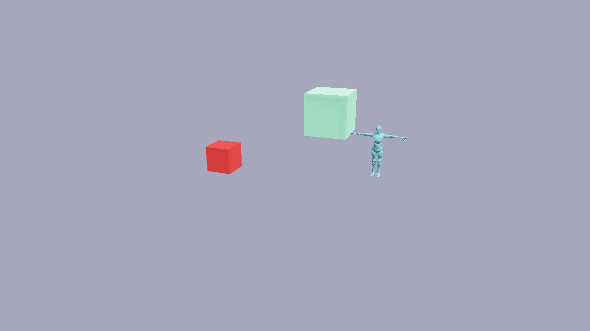
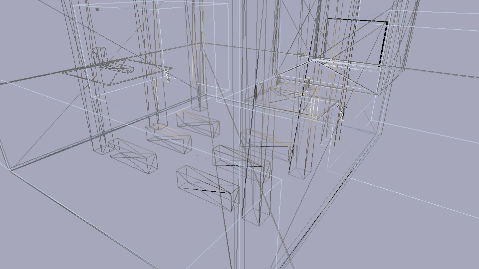
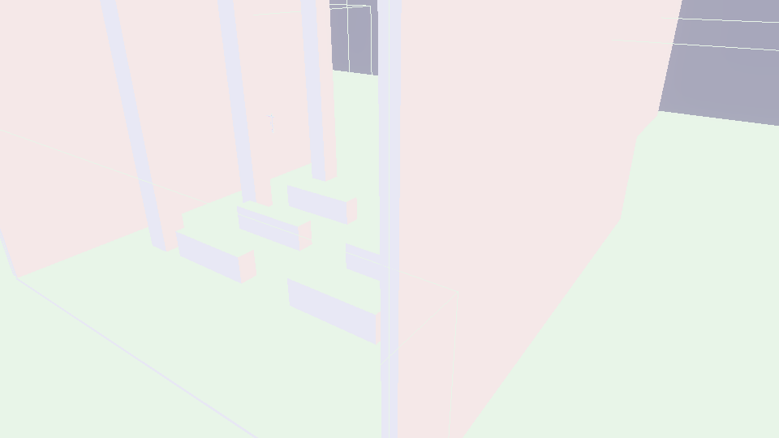

# Rendering

Flint uses wgpu 23 for cross-platform GPU rendering, providing physically-based rendering (PBR) with a Cook-Torrance BRDF, cascaded shadow mapping, optional 4x MSAA, and full glTF mesh support.

## PBR Shading

The renderer implements a metallic-roughness PBR workflow based on the Cook-Torrance specular BRDF:

- **Base color** --- the surface albedo, optionally sampled from a texture
- **Roughness** --- controls specular highlight spread (0.0 = mirror, 1.0 = diffuse)
- **Metallic** --- interpolates between dielectric and metallic response
- **Emissive** --- self-illumination for light sources and glowing objects

Materials are defined in scene TOML via the `material` component, matching the fields in `schemas/components/material.toml`.

Diffuse shading is Lambert by default, but the scene can blend toward Oren-Nayar, soften the terminator with diffuse wrap, and add a Charlie-sheen rim through the `[environment]` block. Those levers, the light component, and area lights are documented on the [Lighting](lighting.md) page.

## Shadow Mapping

Directional lights cast shadows via cascaded shadow maps. Multiple shadow cascades cover different distance ranges from the camera, giving high-resolution shadows close up and broader coverage at distance. A directional light with a non-zero `angular_size` gets contact-hardening PCSS shadows instead of the fixed PCF kernel.

Shadows are toggled at runtime from the Rendering & Effects menu (**F4**), which also offers the shadow-map resolution (512 to 4096). Headlessly, use `--no-shadows` and `--shadow-resolution`. See [Lighting](lighting.md#shadows) for details.

## Camera Modes

The renderer supports two camera modes that share the same view/projection math:

| Mode | Usage | Controls |
|------|-------|----------|
| **Orbit** | Scene viewer (`flint edit`) | Left-drag to orbit, right-drag to pan, scroll or Q/E to zoom, WASD to orbit by key |
| **First-person** | Player (`flint play`) | WASD to move, mouse to look, Space to jump, Shift to sprint |

The camera mode is determined by the entry point: `edit` uses orbit, `play` uses first-person. Both produce the same view and projection matrices. A scene's `[camera]` block seeds the orbit camera in the viewer and the framing in `flint render`; in the viewer, **Space** returns to that authored framing.

## glTF Mesh Rendering

Imported glTF models are rendered with their full mesh geometry and materials. The `flint-import` crate extracts meshes, materials, and textures from `.glb`/`.gltf` files, which the renderer draws with PBR shading.

## Skinned Mesh Pipeline

For skeletal animation, the renderer provides a separate GPU pipeline that applies bone matrix skinning in the vertex shader. This avoids the 32-byte overhead of bone data on static geometry.

**How it works:**

1. `flint-import` extracts joint indices and weights from glTF skins alongside the mesh data
2. `flint-animation` evaluates keyframes and computes bone matrices each frame (local pose -> global hierarchy -> inverse bind matrix)
3. The renderer uploads bone matrices to a **per-entity** storage buffer and applies them in the vertex shader

**Key types:**

- `SkinnedVertex` --- extends the standard vertex with `joint_indices: [u32; 4]` and `joint_weights: [f32; 4]` (6 attributes total vs. 4 for static geometry)
- `GpuSkinnedMesh` --- holds the vertex/index buffers and material for a skinned asset
- Skinned pipeline uses bind groups 0--3: transform, material, lights, and bones (storage buffer, read-only, vertex-visible)

Bone buffers are keyed by entity, not by asset. Two entities that instance the same skinned model animate independently; before this change every instance showed whichever skeleton uploaded last. Skinned meshes also cast shadows through a dedicated `vs_skinned_shadow` shader entry point that applies bone transforms before depth rendering, and both wireframe debug modes draw them posed, using a per-draw unique-edge index buffer.

## Billboard Sprites

Billboard sprites are camera-facing quads used for 2D elements in 3D space --- enemies, pickups, particle effects, and environmental details. They always face the camera, like classic Doom-style sprites.

The `BillboardPipeline` is a separate rendering pipeline from PBR, optimized for flat textured quads:

- **No vertex buffer** --- quad positions are generated procedurally from `vertex_index` (4 vertices per sprite)
- **Per-sprite uniform buffer** --- each sprite gets its own instance data (position, size, frame, anchor)
- **Binary alpha** --- the fragment shader uses `discard` for transparent pixels (avoids order-independent transparency complexity)
- **Sprite sheet animation** --- supports multi-frame sprite sheets via `frame`, `frames_x`, and `frames_y` fields
- **Render order** --- billboard sprites render after skinned meshes in the pipeline

### Sprite Component

Attach a sprite to any entity with the `sprite` component:

```toml
[entities.imp]
archetype = "enemy"

[entities.imp.transform]
position = [10, 0, 5]

[entities.imp.sprite]
texture = "imp_spritesheet"
width = 1.5
height = 2.0
frames_x = 4
frames_y = 1
frame = 0
anchor_y = 0.0
fullbright = true
```

| Field | Type | Default | Description |
|-------|------|---------|-------------|
| `texture` | string | `""` | Sprite sheet texture name (from `sprites/` directory) |
| `width` | f32 | `1.0` | World-space width of the quad |
| `height` | f32 | `1.0` | World-space height of the quad |
| `frame` | i32 | `0` | Current frame index in the sprite sheet |
| `frames_x` | i32 | `1` | Number of columns in the sprite sheet |
| `frames_y` | i32 | `1` | Number of rows in the sprite sheet |
| `anchor_y` | f32 | `0.0` | Vertical anchor point (0.0 = bottom, 0.5 = center) |
| `fullbright` | bool | `true` | If true, bypasses PBR lighting (always fully lit) |
| `visible` | bool | `true` | Whether the sprite is rendered |

### Design Decisions

Billboard sprites use a **separate pipeline** rather than extending the PBR pipeline. This keeps the PBR shaders clean and allows sprites to opt out of lighting entirely (`fullbright = true`). The `discard`-based alpha approach is simple and avoids the significant complexity of order-independent transparency, at the cost of no partial transparency (pixels are either fully opaque or fully transparent).

## MSAA

Every scene pipeline (PBR, skinned, sky, skybox, ocean, terrain, grass, particles, billboards, 2D sprites) takes a sample count, so the scene passes can run at 4x MSAA (ADR 0058). Post-processing, shadow and blit passes stay single-sample, and depth-reading effects consume a sample-0 depth resolve. Enable it with `flint render --msaa 4` or `flint-player --msaa 4`; the default is 1 so headless pixel gates stay single-sample.

## Post-Processing

The renderer includes an HDR post-processing pipeline that applies bloom, SSAO, fog, volumetric light, depth of field, Kuwahara, color grade, film grain, tonemapping, vignette, FXAA and render modes as fullscreen passes. See [Post-Processing](post-processing.md) for full details.

When post-processing is active, all scene pipelines render to an `Rgba16Float` HDR intermediate buffer. A composite fullscreen pass then applies exposure, ACES tonemapping and the rest of the chain to produce the final sRGB output.

Configure post-processing per-scene via the `[post_process]` TOML block, override with `flint render` flags (`--no-postprocess`, `--bloom-intensity`, `--exposure`, `--dof`, `--grade-gain`, and the rest of the set listed on the post-processing page), or tune it live from the F4 menu.

## PBR Materials



*PBR materials with varying roughness and metallic values. Left to right: rough dielectric, smooth dielectric, rough metal, polished metal.*

## Debug Visualization

The renderer provides eight shading modes, selected from the **Shading** combo in the Rendering & Effects menu (F4) or with `--debug-mode` headlessly:

| Mode | `--debug-mode` | Description |
|------|----------------|-------------|
| **PBR** | (default) | Standard Cook-Torrance shading |
| **Wireframe overlay** | `--wireframe-overlay` | Edge lines drawn over solid PBR shading |
| **Wireframe** | `wireframe` | Edge lines only, no fill |
| **Normals** | `normals` | World-space surface normals mapped to RGB |
| **Depth** | `depth` | Linearized depth as grayscale |
| **UV Checker** | `uv` | UV coordinates as a procedural checkerboard |
| **Unlit** | `unlit` | Albedo color only, no lighting |
| **Metal/Rough** | `metalrough` | Metallic (red channel) and roughness (green channel) |

Both wireframe modes draw skinned meshes in their animated pose; rigged models used to get no lines at all in the overlay and vanished in wireframe-only.

Additional overlays:

- **Normal arrows** (F3 in the viewer, `--show-normals` in render) --- draws face-normal direction arrows
- **Skeleton overlay** (model previewer) --- draws the armature over a rigged model, following the animated pose, with a colour mode that paints joints by last writer, layer weight, mask, or keyed joints. See [Animation](animation.md).
- **Render stats** (F2 in the viewer and the player) --- frame time, draw counts, resolution



*Wireframe debug mode showing mesh topology.*



*Normal debug mode mapping world-space normals to RGB channels.*

## Viewer vs Headless

The renderer operates in two modes:

**Viewer mode** (`flint edit scene.toml --watch`) opens an interactive window with:
- Real-time PBR rendering, with the scene's `[post_process]` block applied on load
- egui inspector panel (entity tree, component editor, constraint overlay)
- Hot-reload: edit the scene TOML and the viewer updates automatically
- The Rendering & Effects menu (**F4**) for every render and post toggle, shading mode, shadows, lighting levers and FOV
- Auto-orbit turntable (**O**, with `[` / `]` for speed) and `--auto-orbit` to start in it

**Headless mode** (`flint render`) renders to a PNG file without opening a window --- useful for CI pipelines and automated screenshots:

```bash
flint render levels/tavern.scene.toml --output preview.png --width 1920 --height 1080
```

## Technology

The rendering stack uses winit 0.30's `ApplicationHandler` trait pattern (not the older event-loop closure style). wgpu 23 provides the GPU abstraction, selecting the best available backend (Vulkan, Metal, or DX12) at runtime.

## Further Reading

- [Lighting](lighting.md) --- the light component, shadows, area lights, and the `[environment]` shading levers
- [The Scene Viewer](../getting-started/viewing.md) --- getting started with the viewer
- [Scripting](scripting.md) --- UI draw API for script-driven HUD overlays
- [Schemas](schemas.md) --- sprite component schema definition
- [Animation](animation.md) --- the animation system that drives skinned meshes
- [Physics and Runtime](physics-and-runtime.md) --- the game loop and first-person gameplay
- [Headless Rendering](../guides/headless-rendering.md) --- CI integration guide
