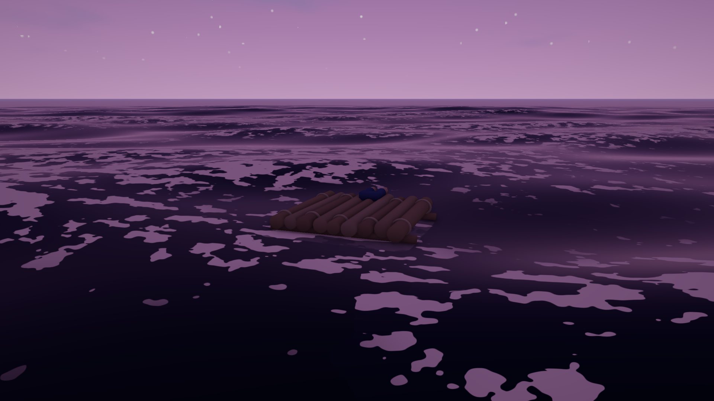

# Sky

The `sky` component replaces the texture skybox with a procedural sky: a
vertical gradient, a sun disc that follows the scene's light, a hashed
starfield, and FBM clouds that drift.



*Every value in this frame is a number on one component. Nothing here is a
texture.*

```toml
[entities.sky_dome]
[entities.sky_dome.sky]
zenith_color = [0.10, 0.32, 0.70, 1.0]
horizon_color = [0.55, 0.75, 0.90, 1.0]
haze_color = [0.80, 0.88, 0.95, 0.55]
cloud_coverage = 0.38
star_opacity = 0.0
```

Add it and the skybox pipeline steps aside. One sky per scene.

## Time of day belongs to your game

**Flint does not have a time-of-day system, and that is deliberate.** The sky
component is a *state*, not a clock. There is no `hour` field, no sun path
built into the engine, no assumption that your world has 24-hour days at all.

A game that wants a day/night cycle writes a script that interpolates its own
keyframes into these fields with `set_field` each frame. That script owns what
"dusk" means for that game — how long it lasts, what color it is, whether the
day is ten minutes or ten hours, whether there are days at all.

The payoff is that the same component serves a game with a wheeling
sunrise-to-starscape cycle, a game permanently frozen at golden hour, and a
game whose sky is driven by something other than time entirely.

The engine's contribution is the **Day / Time** debug panel (`F3`), which
drives a game-side `time_of_day` component by convention — see
[the CLI reference](../cli-reference/overview.md#debug-panels-f3).

## Fields

| Field | Effect |
|-------|--------|
| `zenith_color` | Sky color straight up. |
| `horizon_color` | Sky color at the horizon. |
| `haze_color` | Horizon haze band; **alpha is its strength**. |
| `cloud_tint` | Cloud color; **alpha is opacity**. |
| `sun_disc_size` | Sun angular radius, in radians. |
| `sun_glow` | Glow strength around the disc. |
| `star_opacity` | Starfield visibility, 0 by day to 1 at night. |
| `cloud_coverage` | 0 clear to 1 overcast. |
| `cloud_density` | Cloud edge softness and thickness. |
| `cloud_scale` | Cloud noise frequency. |
| `cloud_drift_x` / `cloud_drift_y` | Cloud drift speed. |
| `ambient_sky` / `ambient_ground` | Optional hemisphere ambient override. |

### The sun

The sun disc is drawn where `directional_lights[0]` points — it is not
positioned independently. Move the light and the disc follows, which means the
visible sun and the light actually casting your shadows can never disagree.

Flint's light `direction` points **from surfaces toward the light**.

### Ambient

`ambient_sky` and `ambient_ground` override the hemisphere ambient in the light
uniforms. This is how a night gets genuinely dark: a script drops both along
with the sun's intensity, and unlit surfaces fall away instead of staying
suspiciously legible.

### Stars

Stars are a hash function, not a texture — no seams, no resolution, and free to
fade with `star_opacity`. The hash is deliberately sinless: `fract(sin(x))`
loses precision far from the origin on some GPUs and breaks into a visible
lattice.

## Reflections

An ocean with `sky_reflection_strength > 0` takes a per-frame snapshot of the
sky's gradient and reflects it, Fresnel-weighted. Change the sky and the water
follows with no extra wiring.

The snapshot carries the gradient only, never the sun disc — see
[Ocean: water clarity](ocean.md#water-clarity) for why.

## See also

- [Ocean](ocean.md) — reflects this sky
- [Rendering](rendering.md) — lights, shadows, and the texture skybox
- [Scripting](scripting.md) — `set_field` for per-frame sky drives
