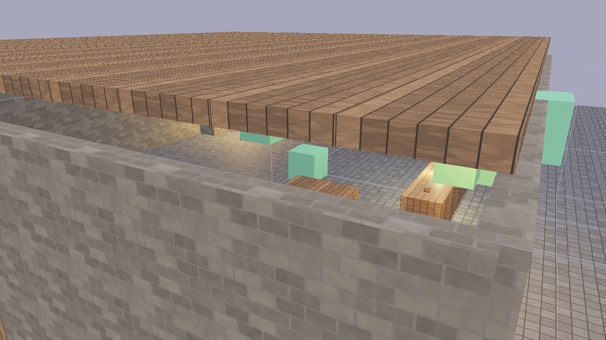

# Building a Tavern



This tutorial walks through building a complete tavern scene from scratch using Flint's CLI. By the end, you'll have a walkable tavern with physics, audio, animation, scripted NPCs, and interactive objects.

## 1. Initialize the Project

```bash
flint init tavern-game
cd tavern-game
```

This creates a project directory with `schemas/` containing default component and archetype definitions.

## 2. Create the Scene

```bash
flint scene create levels/tavern.scene.toml --name "The Rusty Flagon"
```

## 3. Build the Rooms

Create the tavern's three rooms using parent-child hierarchy:

```bash
SCENE="levels/tavern.scene.toml"

# Main hall
flint entity create --archetype room --name "main_hall" --scene $SCENE
flint entity create --archetype room --name "kitchen" --scene $SCENE
flint entity create --archetype room --name "storage" --scene $SCENE
```

Now edit the TOML directly to set positions and dimensions. Each room needs a transform and bounds:

```toml
[entities.main_hall]
archetype = "room"

[entities.main_hall.transform]
position = [0.0, 0.0, 0.0]

[entities.main_hall.bounds]
size = [15.0, 4.0, 12.0]
```

## 4. Add Physics Colliders

For the scene to be walkable, surfaces need physics colliders. Add walls, floor, and ceiling:

```toml
[entities.floor]
archetype = "wall"

[entities.floor.transform]
position = [0.0, -0.25, 0.0]

[entities.floor.collider]
shape = "box"
size = [20.0, 0.5, 20.0]

[entities.floor.rigidbody]
body_type = "static"

[entities.north_wall]
archetype = "wall"

[entities.north_wall.transform]
position = [0.0, 2.0, -10.0]

[entities.north_wall.collider]
shape = "box"
size = [20.0, 4.0, 0.5]

[entities.north_wall.rigidbody]
body_type = "static"
```

Repeat for all walls. Static rigidbodies are immovable world geometry that the player collides with.

## 5. Create the Player

The player entity bundles a character controller, transform, and audio listener:

```toml
[entities.player]
archetype = "player"

[entities.player.transform]
position = [0.0, 1.0, 5.0]

[entities.player.character_controller]
move_speed = 6.0
jump_force = 7.0
height = 1.8
radius = 0.3
```

## 6. Add Furniture

Place objects throughout the tavern:

```toml
[entities.bar_counter]
archetype = "furniture"

[entities.bar_counter.transform]
position = [-3.0, 0.5, -2.0]
scale = [3.0, 1.0, 0.8]

[entities.bar_counter.collider]
shape = "box"
size = [3.0, 1.0, 0.8]

[entities.bar_counter.rigidbody]
body_type = "static"

[entities.fireplace]
archetype = "furniture"

[entities.fireplace.transform]
position = [5.0, 0.5, -8.0]

[entities.fireplace.material]
emissive = [1.0, 0.4, 0.1]
emissive_strength = 2.0
```

## 7. Add Audio

Attach spatial sounds to entities:

```toml
[entities.fireplace.audio_source]
file = "audio/fire_crackle.ogg"
volume = 0.8
loop = true
spatial = true
min_distance = 1.0
max_distance = 15.0

[entities.ambience]

[entities.ambience.audio_source]
file = "audio/tavern_ambient.ogg"
volume = 0.3
loop = true
spatial = false
```

Place audio files (OGG, WAV, MP3, or FLAC) in the `audio/` directory next to the scene.

## 8. Add Animations

Create animation clips in `animations/`:

```toml
# animations/platform_bob.anim.toml
name = "platform_bob"
duration = 4.0

[[tracks]]
interpolation = "CubicSpline"

[tracks.target]
type = "Position"

[[tracks.keyframes]]
time = 0.0
value = [2.0, 0.5, 3.0]

[[tracks.keyframes]]
time = 2.0
value = [2.0, 1.5, 3.0]

[[tracks.keyframes]]
time = 4.0
value = [2.0, 0.5, 3.0]
```

Attach an animator to the entity:

```toml
[entities.platform.animator]
clip = "platform_bob"
autoplay = true
loop = true
speed = 1.0
```

## 9. Add Interactable Objects

Make the door interactive with a script:

```toml
[entities.front_door]
archetype = "door"

[entities.front_door.transform]
position = [0.0, 1.0, -5.0]

[entities.front_door.interactable]
prompt_text = "Open Door"
range = 3.0
interaction_type = "use"

[entities.front_door.script]
source = "door_interact.rhai"
```

Create the script in `scripts/door_interact.rhai`:

```rust
let door_open = false;

fn on_interact() {
    let me = self_entity();
    door_open = !door_open;

    if door_open {
        play_clip(me, "door_swing");
        play_sound("door_open");
    } else {
        play_clip(me, "door_close");
        play_sound("door_close");
    }
}
```

## 10. Add NPCs

Create NPC entities with scripts for behavior:

```toml
[entities.bartender]
archetype = "npc"

[entities.bartender.transform]
position = [-3.0, 0.0, -3.0]

[entities.bartender.interactable]
prompt_text = "Talk to Bartender"
range = 3.0
interaction_type = "talk"

[entities.bartender.script]
source = "bartender.rhai"
```

## 11. Validate and Test

```bash
# Check the scene against constraints
flint validate levels/tavern.scene.toml

# View in the scene viewer with hot-reload
flint serve levels/tavern.scene.toml --watch

# Walk through the tavern in first person
flint play levels/tavern.scene.toml
```

## 12. The Finished Result

The `demo/phase4_runtime.scene.toml` in the Flint repository is a complete implementation of this tavern, with:

- Three rooms (main hall, kitchen, storage) with physics colliders on all surfaces
- A bar counter, tables, fireplace, and barrels
- Four NPCs: bartender, two patrons, and a mysterious stranger with scripted behaviors
- Spatial audio: fire crackle, ambient tavern noise, door sounds, glass clinks
- Property animations: bobbing platform, door swings
- Interactable doors and NPCs with HUD prompts
- Footstep sounds synced to player movement

```bash
# Try the finished demo
cargo run --bin flint -- play demo/phase4_runtime.scene.toml
```

## Further Reading

- [Scripting](../concepts/scripting.md) --- full Rhai API reference
- [Audio](../concepts/audio.md) --- spatial audio system
- [Animation](../concepts/animation.md) --- property tweens and skeletal animation
- [Physics and Runtime](../concepts/physics-and-runtime.md) --- game loop and character controller
