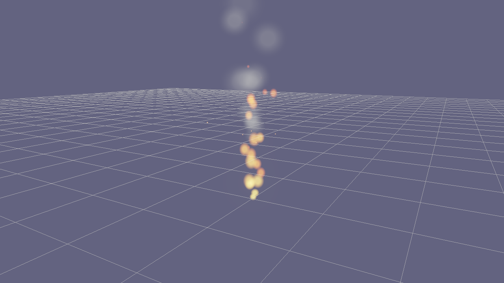

# Particle Editor

`flint edit <file>.particles.toml` opens a dedicated editor for one effect asset: a viewport with the effect playing at the origin, an emitter list and per-emitter sections on the left, and a scrub timeline along the bottom (ADR 0068). It edits the same `*.particles.toml` format the player loads from `particles/` next to a scene, so what you tune here is exactly what `particle_effect = "name"` shows in game.



```bash
flint edit demo/particles/campfire.particles.toml          # open an effect
flint edit fx/torch.particles.toml --preset fire            # create from a preset, then open
flint edit fx/torch.particles.toml --render out.png --anim-time 1.5   # headless snapshot
```

If the file does not exist it is created from a preset (`fire`, `smoke`, `sparks` or `rain`; `sparks` when `--preset` is omitted) and named after the file stem.

## Layout

- **Left panel** — the effect's name and seed, then the emitter list. Each row has a colour swatch, alive/capacity counts, **^** / **v** reorder buttons, a gizmo toggle (**◎**), and **M**ute / **S**olo toggles that affect the preview only and are never saved. Right-click a row to duplicate or delete it. Below the list, the selected emitter's sections: Emission, Shape, Motion & Forces, Over Lifetime, Rendering, Bursts, Sub-emitters.
- **Viewport** — the effect at the origin over the ground grid, with wireframe gizmos showing each emitter's spawn volume and direction (the selected one in orange). Orbit with the mouse or WASD, zoom with the wheel or Q/E.
- **Timeline** — transport buttons, the current time, a scrub track with burst markers (▲) and duration spans, the preview length, a loop toggle and a speed multiplier.
- **Overlays** — a stats card (alive count per emitter, step cost) top-left and view toggles top-right. **H** hides everything but the viewport.

## Curves and Gradients

Size, alpha and speed curves are edited in a small curve widget; colour is a gradient bar with a swatch per key.

- **Drag** a key to move it (its `t` is kept between its neighbours).
- **Double-click** empty space to add a key.
- **Right-click** a key to remove it (a curve keeps at least two).
- **Shift-drag** locks `t` so only the value moves.

The `interp` combo beside a curve chooses `linear`, `smooth` (eased) or `step`. Size is edited as a width curve plus a height/width ratio; per-axis key lists can still be authored by hand in the file.

## Scrubbing Is Deterministic

Scrubbing does not fast-forward: the editor re-simulates from `t = 0` in fixed 1/120 s steps to the requested time, and playback advances with the same fixed step. A paused frame, a scrubbed frame and a `--render --anim-time` snapshot at the same time are bit-identical, so what you approve in the timeline is what the headless check sees. Every edit re-simulates to the current time, which is why long preview lengths on dense effects can feel heavy — shorten the preview length (the seconds field beside the track) while tuning.

## Saving

**Ctrl+S** writes the file. When the emitter list has the same names in the same order as on disk, only the keys whose values changed are patched into the existing document, so comments and layout survive. Adding, removing, renaming or reordering emitters rewrites the whole file from the effect (comments inside it are lost; the status line says "rewritten"). A file the editor cannot validate (a sub-emitter targeting a missing name, a repeating burst without an interval) is not saved; the error shows at the top of the panel.

The editor watches the file and reloads it when something else writes it. Its own save is ignored by the watcher for a moment so it does not reload itself.

## Keys

| Key | Action |
|---|---|
| Space | Play / pause |
| R | Restart from 0 |
| Home / End | Seek to start / preview end |
| ← / → | Step one fixed step back / forward (Shift: 0.1 s) |
| L | Toggle loop |
| [ / ] | Halve / double playback speed (auto-orbit speed while **O** is on) |
| O | Toggle auto-orbit turntable |
| G | Toggle grid |
| X | Toggle shape gizmos |
| B | Cycle backdrop: dark, light, black (review alpha effects against each) |
| H | Hide / show the UI |
| Ctrl+S | Save |
| Ctrl+Z / Ctrl+Y (or Ctrl+Shift+Z) | Undo / redo |
| Ctrl+D | Duplicate the selected emitter |
| Delete | Delete the selected emitter |
| Ctrl+R | Reload from disk |
| Escape | Quit (twice when there are unsaved changes) |

## Flags

`flint edit` passes these through when the file is a `.particles.toml`:

| Flag | Default | Description |
|---|---|---|
| `--preset <name>` | `sparks` | Preset used when the file does not exist yet: `fire`, `smoke`, `sparks`, `rain` |
| `--render <path>` | (none) | Render a PNG instead of opening a window |
| `--anim-time <s>` | `1.0` | Simulation time for `--render` |
| `--distance`, `--yaw`, `--pitch`, `--target`, `--fov` | (auto) | Camera, as for the model previewer |
| `--no-grid`, `--auto-orbit`, `--width`, `--height` | | As elsewhere |

## Workflow

1. `flint edit fx/new.particles.toml --preset fire` — start from the closest preset.
2. Tune with the effect playing; mute or solo emitters to isolate one layer.
3. Scrub to the frame that matters and check it against the light backdrop (**B**).
4. **Ctrl+S**, then reference the effect from a scene with `particle_effect = { effect = "new" }` and confirm in the scene viewer or with `flint render scene.scene.toml --particle-time 2`.
5. For a review hand-off, `--render` the same time twice; identical bytes mean the frame is reproducible.

See [Particles](../concepts/particles.md) for the asset format in full.
