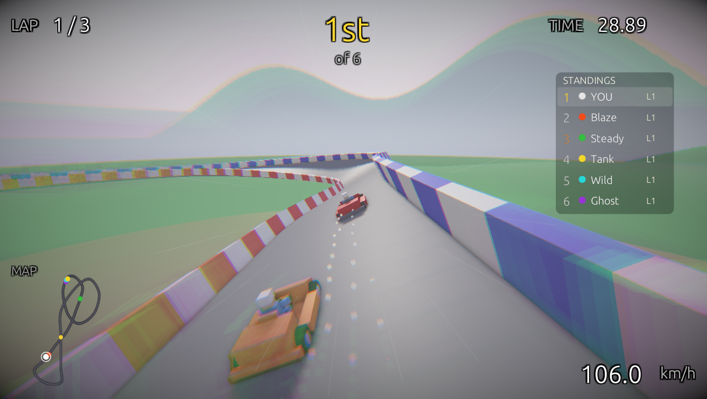
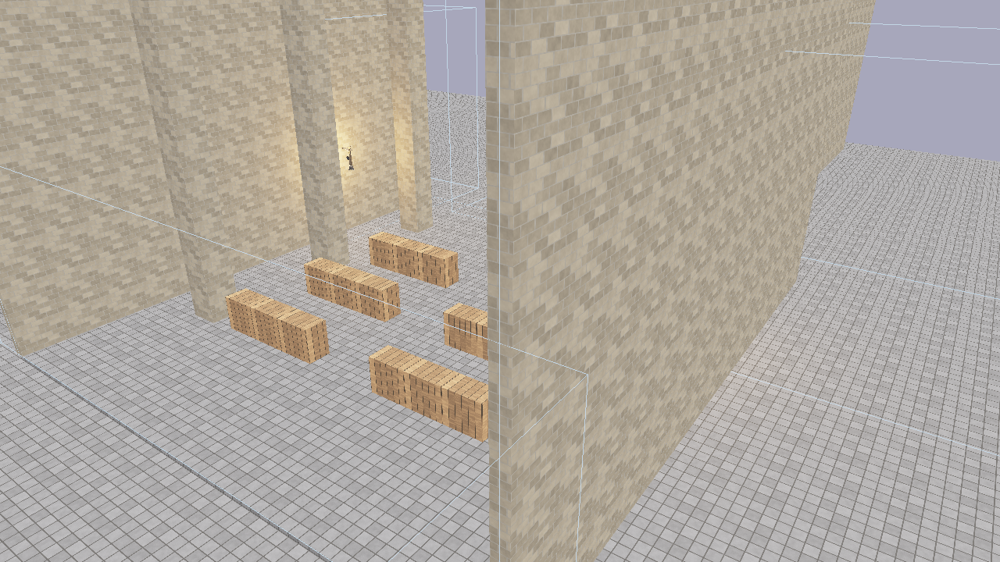
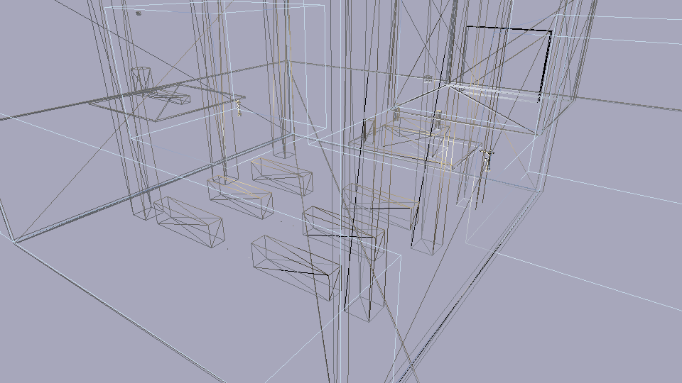

# Flint Engine

**A CLI-first, AI-agent-optimized 3D game engine written in Rust.**

Flint is a general-purpose 3D game engine designed from the ground up to provide an excellent interface for AI coding agents, while maintaining effective workflows for human developers. Unlike existing engines that optimize for GUI-driven workflows, Flint prioritizes programmatic interaction, introspection, and validation.

## The Core Idea

Current game engines are built around visual editors, drag-and-drop workflows, and GUI-heavy tooling. These become friction points when AI agents attempt to make changes programmatically --- the agent ends up fighting against abstractions designed for human spatial reasoning and visual feedback loops.

Flint inverts this: **the primary interface is CLI and code**, with visual tools focused on *validating* results rather than *creating* them.

Every scene is a TOML file you can read, diff, and version. Every operation is a composable CLI command. Every piece of engine state is queryable as structured data. The viewer exists to answer one question: *"Did the agent do what I asked?"*

## Built with Flint



*FlintKart: a kart racing game built as a standalone project using Flint's game project architecture — custom schemas, scripts, and assets layered on top of the engine via git subtree.*

## Visual Showcase



*The Luminarium showcase scene: Cook-Torrance PBR shading with cascaded shadows, textured walls and floors, glTF models, and emissive materials.*



*Wireframe debug mode (F1) reveals mesh topology — one of seven built-in debug visualizations for inspecting geometry, normals, depth, UVs, and material properties.*

## What It Looks Like

Create a scene, add entities, query them, and view the result --- all from the command line:

```bash
# Initialize a project
flint init my-game

# Create a scene and populate it
flint scene create levels/tavern.scene.toml --name "The Tavern"
flint entity create --archetype room --name "main_hall" --scene levels/tavern.scene.toml
flint entity create --archetype door --name "front_door" --parent "main_hall" --scene levels/tavern.scene.toml

# Query what you've built
flint query "entities where archetype == 'door'" --scene levels/tavern.scene.toml

# Validate against constraints
flint validate levels/tavern.scene.toml --fix --dry-run

# See it in 3D with PBR rendering
flint serve levels/tavern.scene.toml --watch

# Walk around in first person
flint play levels/tavern.scene.toml
```

## Current Status

The engine supports:

- **Entity CRUD** via CLI with archetype-based creation
- **Scene serialization** in human-readable TOML
- **Query language** for filtering and inspecting entities
- **Schema system** for component and archetype definitions
- **Constraint validation** with auto-fix capabilities
- **Asset management** with content-addressed storage and glTF import
- **PBR renderer** with Cook-Torrance shading, cascaded shadow mapping, and glTF mesh rendering
- **GPU skeletal animation** with glTF skin/joint import, vertex skinning, and crossfade blending
- **egui inspector** with entity tree, component editing, and constraint overlay
- **Hot-reload viewer** that watches for file changes
- **Headless rendering** for CI and automated screenshots
- **Physics simulation** via Rapier 3D with kinematic character controller
- **First-person gameplay** with WASD movement, mouse look, jumping, and sprinting
- **Game loop** with fixed-timestep accumulator for deterministic physics
- **Spatial audio** via Kira with 3D positioned sounds, ambient loops, and event-driven triggers
- **Property animation** with TOML-defined keyframe clips (Step, Linear, CubicSpline interpolation)
- **Skeletal animation** with glTF skin import, GPU bone matrix skinning, and crossfade blending
- **Rhai scripting** with entity/input/audio/animation APIs, event callbacks, and hot-reload
- **Interactable entities** with HUD prompts, proximity detection, and scripted behaviors
- **AI asset generation** with pluggable providers (Flux textures, Meshy 3D models, ElevenLabs audio), style guides, batch scene resolution, model validation, and build manifests
- **Billboard sprites** with camera-facing quads and sprite sheet animation
- **GPU particle system** with instanced rendering, per-emitter pooling, alpha/additive blending, and configurable emission shapes
- **Extensible input system** with config-driven bindings for keyboard, mouse, and gamepad with runtime rebinding
- **Data-driven UI system** with TOML-defined layouts, style classes, anchor-based positioning, flow layouts, and runtime scripting API
- **Game project architecture** for standalone games that include the engine as a git subtree

See the [Roadmap](roadmap.md) for the full development history.

## Who Is This For?

- **AI agent developers** building game content programmatically
- **Technical game developers** who prefer code over visual editors
- **Tooling enthusiasts** who want to compose game development operations
- **Rust game developers** looking for a deterministic, introspectable engine

## Reading This Guide

- Start with [Why Flint?](philosophy/why-flint.md) to understand the motivation
- Follow the [Getting Started](getting-started/installation.md) guide to build from source and create your first project
- Explore [Core Concepts](concepts/entities-and-ecs.md) to learn about the engine's systems
- Check the [Architecture](architecture/overview.md) section if you want to understand the codebase
- Browse the [API Reference](/flint/api/flint_core/) for per-crate Rust documentation
